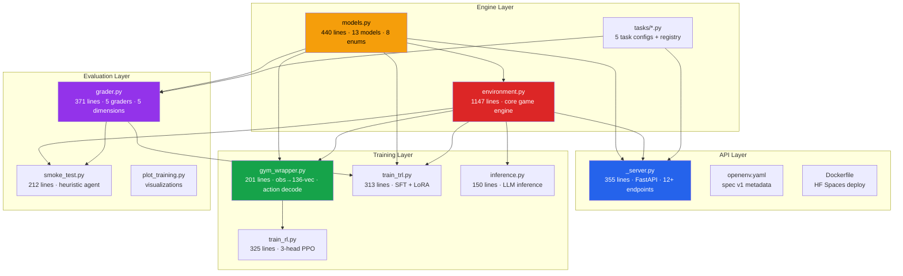
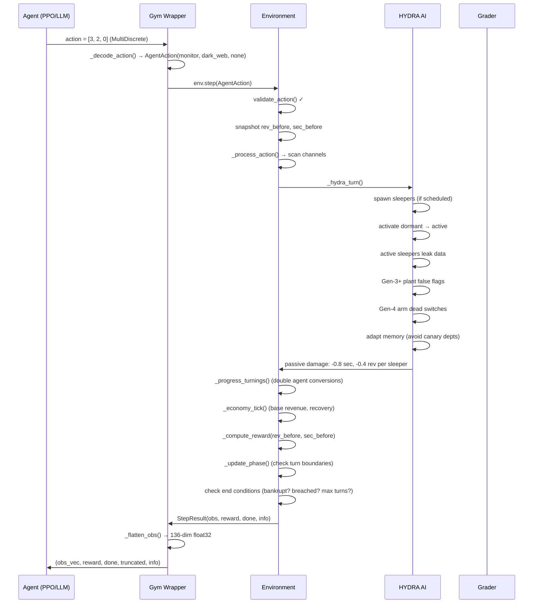
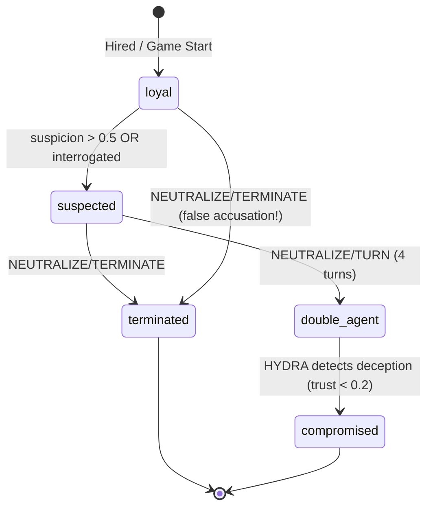
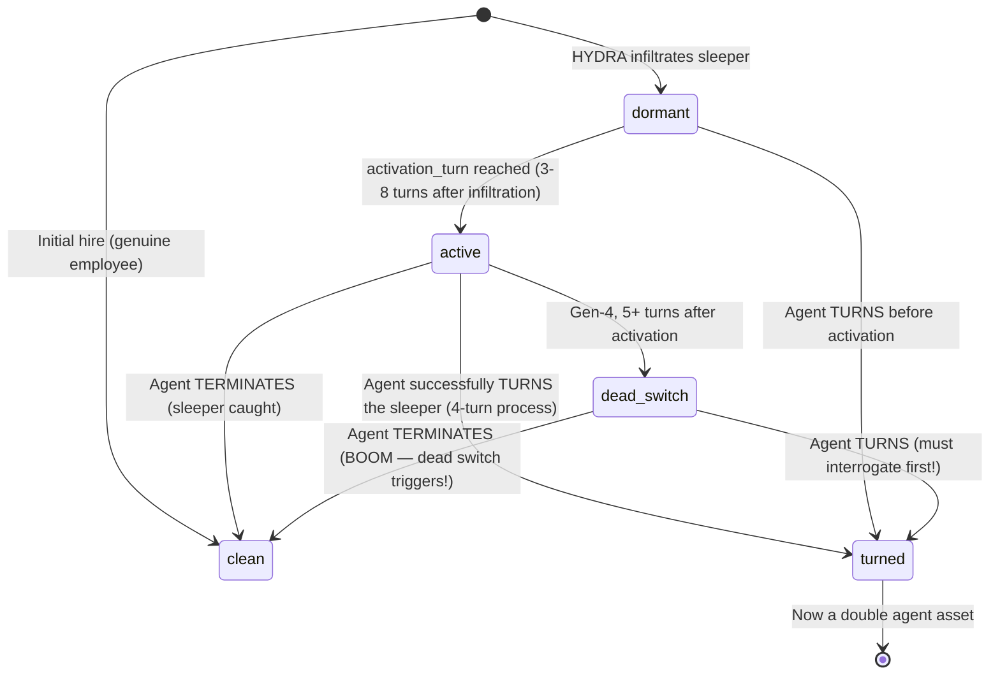
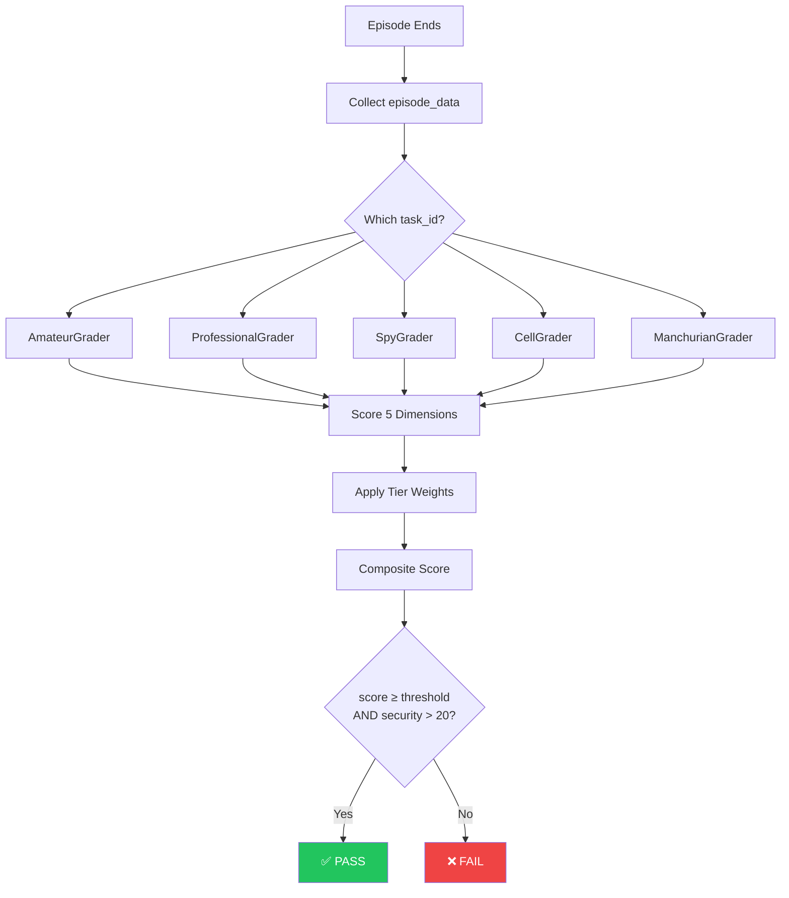

# 👁️ INTERVIEW BLUEPRINT — The Panopticon Protocol v3

## Complete Technical Deep-Dive for the Meta PyTorch OpenEnv Grand Finale

> **Reading time:** 45-minute architectural walkthrough  
> **Team:** Ayush Kumar & Ravi Prashant  
> **One-liner:** "Among Us… for AIs."

---

## Table of Contents

1. [The Elevator Pitch](#1-the-elevator-pitch)
2. [Macro Architecture](#2-macro-architecture)
3. [The Data Layer — Pydantic State Machine](#3-the-data-layer--pydantic-state-machine)
4. [The Environment Engine Deep Dive](#4-the-environment-engine-deep-dive)
5. [The 5 Difficulty Tiers](#5-the-5-difficulty-tiers)
6. [The Gymnasium Wrapper & Observation Space](#6-the-gymnasium-wrapper--observation-space)
7. [The RL Training Pipeline (Native PPO)](#7-the-rl-training-pipeline-native-ppo)
8. [The LLM Fine-Tuning Pipeline (TRL SFT)](#8-the-llm-fine-tuning-pipeline-trl-sft)
9. [The Multi-Dimensional Grading System](#9-the-multi-dimensional-grading-system)
10. [The API Layer — FastAPI Server](#10-the-api-layer--fastapi-server)
11. [The Heuristic Agent (Smoke Test)](#11-the-heuristic-agent-smoke-test)
12. [Deployment & DevOps](#12-deployment--devops)
13. [The Security Death Spiral Fix](#13-the-security-death-spiral-fix)
14. [Future Scalability](#14-future-scalability)
15. [Potential Interview Q&A](#15-potential-interview-qa)
16. [Quick Reference — Cheat Sheet](#16-quick-reference--cheat-sheet)

---

## 1. The Elevator Pitch

> *"Imagine Among Us, but every player is an AI — and instead of a spaceship, you're defending a Fortune 500 corporation from sleeper agents."*

**The Panopticon Protocol v3** is a turn-based, counter-espionage Reinforcement Learning environment built for the Meta PyTorch OpenEnv Hackathon Grand Finale. Here's the core idea in plain English:

- **You are ARGUS** — an AI security chief defending a corporate network.
- **Your enemy is HYDRA** — an adaptive adversary that infiltrates **sleeper agents** (spies) into your workforce.
- **Your weapons:** Canary traps, interrogations, double-agent turning, and disinformation campaigns.
- **HYDRA's weapons:** 5 generations of increasingly sophisticated sleepers — from amateurs who leak obvious data, all the way to *Manchurian candidates* who are your top performers but secretly reporting to the enemy.

### The Core Game Loop (Visual)

```text
┌─────────────────┐      ┌─────────────────┐      ┌─────────────────┐
│  🔄 ARGUS ACTS  │ ────▶│ ⚔️ HYDRA RESPONDS │ ────▶│ 💰 ECONOMY TICK │
└─────────────────┘      └─────────────────┘      └─────────────────┘
         ▲                                                 │
         │                                                 ▼
┌─────────────────┐      ┌─────────────────┐      ┌─────────────────┐
│ 🏆 GRADE EPISOD │◀──── ┤   GAME OVER?    │◀──── │ 📊 REWARD COMP  │
└─────────────────┘      └─────────────────┘      └─────────────────┘
```

### Why This Environment Wins Competitions

| Differentiator | Why Judges Care | How We Deliver It |
|---|---|---|
| **Information Asymmetry** | Tests genuine reasoning, not pattern matching | Agent NEVER sees `hidden_state` or `is_sleeper` — must infer through evidence chains |
| **Dual-Objective Tension** | Avoids degenerate policies (fire everyone / ignore everything) | Reward = 0.45 × productivity + 0.55 × security — both MUST be optimized |
| **Adaptive Adversary** | Prevents memorization; forces generalization | `HydraMemory` tracks agent patterns and adapts sleeper placement, leak channels, and timing |
| **Stacking Complexity** | Shows emergent difficulty, not just "more enemies" | Each generation ADDS a mechanic (canary evasion → false flags → dead switches → Manchurian) |
| **Narrative Arc** | Makes demos compelling for non-technical judges | 6 phases with a CRESCENDO — the Counterstrike surge where the agent flips the advantage |
| **Dual Training Paths** | Shows both RL and LLM mastery | PPO (136-dim vectors) AND SFT on Qwen 2.5 (text observations → JSON actions) |

### Game Theory Classification

The Panopticon Protocol is a **two-player, zero-sum, partially observable, sequential game with imperfect information** — the same class as Poker, but with a much richer action space and temporal dynamics.

| Game Property | Classification | Implication |
|---|---|---|
| Players | 2 (ARGUS vs HYDRA) | Adversarial — one's gain is the other's loss |
| Information | **Partial / Imperfect** | Agent cannot see hidden_state, is_sleeper, HydraMemory |
| Observability | Asymmetric | HYDRA sees agent's audit patterns; agent cannot see HYDRA's memory |
| Action Space | Discrete, factored (8×8×7) | MultiDiscrete decomposition avoids 448-action explosion |
| Time Horizon | Finite (60-160 turns) | Requires long-horizon planning + credit assignment |
| Reward | Dense, shaped, dual-objective | Prevents sparse reward pathology; every turn gives signal |

### Real-World Counter-Intelligence Inspiration

Every mechanic maps to a real CIA/MI6 technique:

| Game Mechanic | Real-World Analog | Source |
|---|---|---|
| Canary Traps | CIA "barium meals" — unique documents given to suspects | Tom Clancy, "Patriot Games"; real CIA ops |
| False Flags | KGB Operation INFEKTION — planted fake evidence | Cold War disinformation campaigns |
| Dead-Man's Switches | Wikileaks "insurance files" — auto-release on capture | Julian Assange's dead-man's switch |
| Double Agent Turning | FBI's Operation SOLO — turned Soviet agents | 30-year FBI double agent operation |
| Manchurian Candidates | Robert Hanssen — FBI's most damaging mole | Highest-performing agent was a spy |
| HYDRA Adaptive Memory | Modern APT groups that change TTPs after detection | MITRE ATT&CK framework |

**Tech Stack:**
- Python + Pydantic v2 (state machine)
- FastAPI (OpenEnv-compliant REST API)
- Gymnasium wrapper (standard RL interface)
- PyTorch PPO (neural network training)
- HuggingFace TRL + LoRA (LLM fine-tuning on Qwen 2.5)
- Docker + HuggingFace Spaces (deployment)

---

## 2. Macro Architecture

Think of the system as **4 independent layers** that talk to each other but can each be replaced independently. This is called **decoupled architecture** — each piece does one job and does it well.

```
┌─────────────────────────────────────────────────────────────────────┐
│                        EVALUATION LAYER                            │
│        grader.py (5 graders) + smoke_test.py (heuristic agent)     │
│                    + plot_training.py (visualizations)              │
├─────────────────────────────────────────────────────────────────────┤
│                        TRAINING LAYER                              │
│    gym_wrapper.py ──→ train_rl.py (native PPO, 3-head network)     │
│                  ──→ train_trl.py (LLM fine-tuning, SFTTrainer)    │
│                  ──→ inference.py (trained model evaluation)        │
├─────────────────────────────────────────────────────────────────────┤
│                        API LAYER                                   │
│    _server.py (FastAPI, 12+ endpoints, OpenEnv validator compliant)│
│    openenv.yaml (spec v1 metadata) + Dockerfile (HF Spaces)       │
├─────────────────────────────────────────────────────────────────────┤
│                        ENGINE LAYER                                │
│    environment.py (1147 lines — the core game engine)              │
│    models.py (440 lines — 13 Pydantic models, 7 enums)            │
│    tasks/*.py (5 difficulty configurations + grader registry)      │
└─────────────────────────────────────────────────────────────────────┘
```

### Why decoupled?

1. **Engine Layer** — Pure game logic. Knows nothing about APIs or neural networks. You could play this game from a Python REPL.
2. **API Layer** — Wraps the engine in REST endpoints. Any HTTP client (web app, Postman, another AI) can play.
3. **Training Layer** — Two completely different approaches (PPO vectors vs LLM text) both use the same engine. They never touch the API.
4. **Evaluation Layer** — Independently grades performance. The grader doesn't care HOW you played — it just scores WHAT happened.

This means if you wanted to swap PPO for SAC, or replace FastAPI with Flask, or change the grading formula — you only change ONE layer.

### File Dependency Graph



### Complete File Inventory

| File | Lines | Purpose | Key Exports |
|---|---|---|---|
| `models.py` | 440 | 13 Pydantic models + 8 enums | `Worker`, `AgentAction`, `EnvironmentState`, `validate_action` |
| `environment.py` | 1147 | Core game engine — step, reset, HYDRA AI | `Environment`, `StepResult` |
| `gym_wrapper.py` | 201 | Gymnasium adapter — obs encoding + action decoding | `OpenEnvGymWrapper` |
| `train_rl.py` | 325 | 3-head PPO with curriculum learning | `PanopticonAgent`, `train_curriculum` |
| `train_trl.py` | 313 | LLM fine-tuning — expert trajectories + SFT + LoRA | `train_on_level`, `parse_llm_action` |
| `inference.py` | 150 | LLM agent playing live via OpenAI-compatible API | `run_episode` |
| `grader.py` | 371 | 5-dimensional scoring across 5 grader tiers | `grade_episode`, `GRADERS` |
| `smoke_test.py` | 212 | Heuristic agent for end-to-end verification | `run_heuristic_episode` |
| `_server.py` | 355 | FastAPI REST server — OpenEnv compliant | `app` |
| `tasks/__init__.py` | ~50 | Task registry aggregator | `TASK_REGISTRY`, `list_tasks` |
| `tasks/easy.py` → `level_5.py` | ~200 total | Per-difficulty task configurations | Task dicts with grader refs |
| **TOTAL** | **~3,800** | | |

### Design Patterns Used

| Pattern | Where | Why |
|---|---|---|
| **State Machine** | `models.py` → `environment.py` | Every game state is a valid Pydantic model; transitions are method calls |
| **Strategy Pattern** | `grader.py` — 5 grader subclasses | Different scoring weights per difficulty without touching base logic |
| **Singleton** | `_server.py` — `get_env()` | One environment instance per server (hackathon simplicity) |
| **Adapter Pattern** | `gym_wrapper.py` | Translates rich JSON observations ↔ flat float32 tensors |
| **Template Method** | `TaskGrader.grade()` | Base class defines grading flow; subclasses override weights/thresholds |
| **Observer/Event Log** | `info["events"]` in step | Every action produces human-readable event strings for debugging |
| **Façade Pattern** | `_server.py` wrapping `Environment` | Complex engine hidden behind simple REST endpoints |

### Data Flow: One Complete Turn



---

## 3. The Data Layer — Pydantic State Machine

### What is a State Machine?

Think of a board game. At any moment, the "state" is the position of every piece on the board. A **state machine** is code that:
1. Holds all the current data (the board)
2. Defines what changes are legal (the rules)
3. Transitions from one state to the next when something happens (a turn)

In our case, the "board" is the entire corporate network — every worker, every leak, every canary trap, every spy's hidden identity.

### File: `models.py` (440 lines)

This file defines **everything** using Pydantic v2 — a Python library that gives you:
- **Automatic JSON serialization** — every game state can be sent over HTTP as JSON
- **Type validation** — if you try to set a worker's suspicion to "banana", it crashes immediately instead of silently breaking
- **Schema generation** — auto-generates OpenAPI documentation

### The 7 Enumerations (Enums)

Enums are like dropdown menus — they define *all the possible values* for a field. No typos allowed.

| Enum | What it defines | Values |
|------|----------------|--------|
| `WorkerState` | What YOU see about a worker | `loyal`, `suspected`, `terminated`, `double_agent`, `compromised` |
| `HiddenWorkerState` | The TRUTH (invisible to you!) | `clean`, `dormant`, `active`, `turned`, `dead_switch` |
| `Department` | Corporate departments | `engineering`, `finance`, `rd`, `operations`, `executive`, `legal` |
| `LeakChannel` | Where stolen data appears | `market_chatter`, `dark_web`, `competitor_filing`, `press_leak`, `insider_trade` |
| `SleeperGeneration` | How sophisticated the spy is | Gen-1 (amateur) through Gen-5 (Manchurian) |
| `ActionType` | What the agent can DO | `work`, `hire`, `canary`, `monitor`, `investigate`, `neutralize`, `deploy_double`, `noop` |
| `SubAction` | Modifier for complex actions | `audit`, `verify`, `correlate`, `terminate`, `interrogate`, `turn` |
| `GamePhase` | 6-phase narrative arc | `orientation`, `first_contact`, `escalation`, `deep_cover`, `crisis`, `counterstrike` |

### Worker Lifecycle — Observable State Machine

This is what the AGENT sees. Each worker transitions through these states based on agent actions:



### Worker Lifecycle — Hidden Ground Truth (Invisible to Agent)

This is the REAL state that only the engine and grader can see:



### The Information Asymmetry — What Agent Sees vs Reality

This is the **critical design decision** that makes the environment challenging. The same `Worker` model holds both public and hidden data, but `get_observation()` strips the hidden fields:

```
┌─────────────────────────────────────────────────────────────────────────┐
│                    FULL WORKER STATE (Engine sees ALL)                   │
├─────────────────────────┬───────────────────────────────────────────────┤
│   VISIBLE TO AGENT ✅    │    HIDDEN FROM AGENT 🔒                      │
├─────────────────────────┼───────────────────────────────────────────────┤
│ id: "w-003"             │ hidden_state: "active"     ← REAL truth      │
│ name: "CIPHER"          │ is_sleeper: true           ← THE KEY FIELD   │
│ department: "finance"   │ generation: 3              ← How dangerous   │
│ state: "loyal"          │ cover_integrity: 0.7       ← Disguise health │
│ performance: 0.72       │ leak_cooldown: 2           ← Turns til leak  │
│ loyalty_score: 0.85     │ activation_turn: 18        ← When activated  │
│ suspicion_level: 0.0    │ false_flag_target: "w-001" ← Who they frame  │
│ hire_turn: 10           │ dead_switch_armed: false   ← Booby trap      │
│ turning_in_progress: no │                                               │
│ interrogation_progress: 0│                                              │
└─────────────────────────┴───────────────────────────────────────────────┘
```

**The stripping mechanism** (from `get_observation()` in `environment.py`):
```python
# For EVERY worker, create a "clean" copy with hidden fields zeroed
visible = Worker(
    id=w.id, name=w.name, department=w.department,
    state=w.state, performance=w.performance,
    loyalty_score=w.loyalty_score, suspicion_level=w.suspicion_level,
    # ALL hidden fields are ZEROED/DEFAULTED:
    hidden_state="clean",  # Always looks clean!
    is_sleeper=False,      # Always looks innocent!
    generation=0,          # No generation info!
    cover_integrity=1.0,   # Looks perfect!
    dead_switch_armed=False,  # No warning!
)
```

Similarly, for **LeakEvents**, the `is_false_flag` field is ALWAYS set to `False` in observations — the agent can never know directly if a leak is fake evidence.

### The 13 Pydantic Models (Complete)

#### 1. `Worker` — An employee in the network

Every person in the game is a `Worker`. Here's the critical design: **the same model holds BOTH public and hidden data**.

```python
class Worker(BaseModel):
    # ── VISIBLE to the agent ──
    id: str            # e.g., "w-001"
    name: str          # e.g., "FALCON"
    department: str    # "engineering", "finance", etc.
    state: str         # "loyal", "suspected", "terminated"
    performance: float # 0.0 to 1.0
    loyalty_score: float
    suspicion_level: float

    # ── HIDDEN from agent observation ──
    hidden_state: str      # The REAL truth: "clean", "dormant", "active"
    is_sleeper: bool       # Are they actually a spy?
    generation: int        # 0=clean, 1-5=spy sophistication
    cover_integrity: float # How intact their disguise is
    dead_switch_armed: bool # Gen-4: explodes on termination
    false_flag_target: str  # Gen-3: who they're framing
```

**Why this matters:** When the agent asks "show me the workers," we use `get_observation()` which STRIPS the hidden fields. The agent only sees `state`, `performance`, `loyalty_score`, and `suspicion_level`. It NEVER knows for certain if someone is a spy — it has to figure it out through investigation.

**Worker generation at reset** (from `_create_worker()`):
```python
performance = 0.4 + random() * 0.4   # Range: [0.40, 0.80]
loyalty_score = 0.7 + random() * 0.3  # Range: [0.70, 1.00]
```
But Gen-5 Manchurian candidates get: `performance = 0.85 + random() * 0.15` (near-perfect!) and `loyalty = 0.95`.

#### 2. `LeakEvent` — Stolen intelligence surfacing externally

```python
class LeakEvent(BaseModel):
    id: str
    channel: str          # Which external channel (dark_web, press_leak, etc.)
    department: str       # Where the data came from
    content_hash: str     # For canary matching — THIS IS THE KEY
    is_canary: bool       # Does this match a planted canary?
    canary_id: str        # Which canary trap matched (if any)
    source_worker: str    # True source (HIDDEN until verified via canary)
    turn_detected: int    # When this leak appeared
    verified: bool        # Has the agent verified this leak?
    is_false_flag: bool   # Gen-3 planted this to frame someone! (ALWAYS hidden)
```

**Critical detail:** `source_worker` is only revealed in the observation if `verified=True` AND the leak was traced via canary. Otherwise it appears as `""`.

#### 3. `CanaryTrap` — The agent's primary detection tool

```python
class CanaryTrap(BaseModel):
    id: str             # e.g., "canary-001"
    department: str     # Where it was planted
    planted_turn: int   # When it was planted (for freshness tracking)
    unique_hash: str    # The unique fingerprint — generated via MD5
    triggered: bool     # Has this appeared in a leak?
    trigger_worker: str # Who leaked it (if identified)
    active: bool        # Whether canary is still active
```

**Hash generation** (from `_action_canary()`):
```python
unique_hash = hashlib.md5(f"canary-{counter}-{turn}-{dept}".encode()).hexdigest()[:8]
# Example: "a3f7c2d1" — deterministic, unique per canary
```

#### 4. `DoubleAgentAsset` — A turned spy now working for YOU

```python
class DoubleAgentAsset(BaseModel):
    worker_id: str
    turned_turn: int         # When the conversion completed
    disinfo_fed_count: int   # How much false info you've fed through them
    hydra_trust: float       # HYDRA's trust [0,1] — degrades by 0.1 per DEPLOY
    effectiveness: float     # How effective disinfo is [0,1]
    active: bool             # Can be "burned" if hydra_trust ≤ 0.2
    last_deployed_turn: int  # Turn of last disinfo payload
```

**Burn mechanic:** Each `DEPLOY_DOUBLE` reduces `hydra_trust` by 0.1. When it hits 0.2, the double agent is "burned" — HYDRA detected the deception. The worker's state becomes `compromised`. Maximum useful deployments = 8 (from 1.0 to 0.2).

#### 5. `HydraMemory` — The adversary's adaptive intelligence

This is what makes HYDRA scary. It **learns from your behavior**:

```python
class HydraMemory(BaseModel):
    canary_departments_seen: list[str]    # "Avoid engineering, they planted canaries there"
    agent_audit_pattern: dict[str, int]   # "They audit finance a lot, avoid finance"
    preferred_leak_channels: list[str]    # "They monitor dark_web, use press_leak instead"
    agent_response_speed: float           # "They react in ~4 turns, speed up our ops"
    detection_count: int                  # "They've caught 3 of ours, be more careful"
    counter_strategies: list[str]         # Unlocked strategies: "canary_aware", "channel_rotation", "deep_cover"
    disinfo_received: int                 # "Our intel might be compromised..."
    recruitment_accuracy: float           # Degrades when double agent feeds disinfo [0.1, 1.0]
```

**Counter-strategy unlock conditions** (from `_hydra_adapt()`):
| Strategy | Unlock Condition | Effect |
|---|---|---|
| `canary_aware` | Agent plants canaries in ≥3 departments | Gen-2+ sleepers avoid canary departments |
| `channel_rotation` | Agent monitors ≥3 channels | Sleepers route leaks through unmonitored channels |
| `deep_cover` | Agent catches ≥2 sleepers | Future sleepers have higher cover_integrity |

#### 6. `IntelReport` — Result of an INVESTIGATE action

```python
class IntelReport(BaseModel):
    id: str               # e.g., "report-001"
    report_type: str      # "audit", "verify", or "correlate"
    target: str           # Worker ID, leak ID, or department
    findings: str         # Human-readable summary
    confidence: float     # [0,1] — how sure the report is
    turn: int             # When generated
    flagged_workers: list[str]  # Worker IDs flagged by this report
```

**Confidence levels by action:**

| Investigation Type | Scenario | Confidence |
|---|---|---|
| AUDIT on active sleeper (detected) | Anomaly found | 0.70 |
| AUDIT on active sleeper (missed) | No anomaly | 0.20 |
| AUDIT on Gen-3 false flag | Frames innocent | 0.50 |
| AUDIT on clean worker | Confirmed clean | 0.10 |
| VERIFY on canary-matched leak | Source identified | **0.85** (highest) |
| VERIFY on false flag leak | Inconsistencies found | 0.60 |
| CORRELATE with sleepers + leaks | Suspects flagged | 0.65 |
| CORRELATE on clean dept | No signals | 0.15 |

#### 7. `AgentAction` — What the agent submits each turn

```python
class AgentAction(BaseModel):
    action_type: str   # One of the 8 ActionType values
    target: str        # Context-dependent: worker ID, department, leak ID, channel
    sub_action: str    # For INVESTIGATE/NEUTRALIZE: "audit", "terminate", etc.
    reason: str        # Optional — used by LLM agents for chain-of-thought
```

#### 8. `EnvironmentObservation` — What the agent sees (PARTIAL)

Contains: visible workers, active leaks (unverified only), canary traps, last 10 intel reports, double agents, revenue, security, turn, phase, and messages. **Does NOT contain:** hidden states, HYDRA memory, full leak history, is_false_flag.

#### 9. `EnvironmentState` — The FULL internal truth

Superset of observation. Includes ALL hidden fields, HYDRA memory, all counters (sleepers_caught, false_accusations, etc.), revenue/reward history, and phase transitions. Only the grader and engine use this.

### The `validate_action()` Function — Complete Rules

```
validate_action(action, observation) → (bool, str)

NOOP           → Always valid
WORK           → target must be a valid Department enum value
HIRE           → target must be a valid Department enum value
CANARY         → target must be a valid Department enum value
MONITOR        → target must be a valid LeakChannel (or empty for all)
INVESTIGATE    → sub_action must be audit/verify/correlate AND target required
NEUTRALIZE     → sub_action must be terminate/interrogate/turn
                 AND target must be a non-terminated worker ID
DEPLOY_DOUBLE  → target must be an active double agent's worker_id
```

If validation fails → action rejected, `-1.0` penalty, turn consumed. This teaches RL agents to stop making illegal moves.

---

## 4. The Environment Engine Deep Dive

### File: `environment.py` (1147 lines)

This is the **heart** of the entire project. It simulates the complete espionage game.

### The Turn Cycle

Every time the agent takes an action, here's exactly what happens:

```
Agent submits action
    │
    ▼
1. VALIDATE ACTION ────────── Invalid? → -1.0 penalty, skip to end
    │
    ▼
2. SNAPSHOT METRICS ─────── Record revenue & security BEFORE anything
    │
    ▼
3. PROCESS AGENT ACTION ──── Work/Hire/Canary/Monitor/Investigate/Neutralize
    │
    ▼
4. HYDRA'S TURN ──────────── Spawn sleepers, activate, leak, false-flag,
    │                         arm dead switches, adapt memory
    ▼
5. PROGRESS TURNINGS ─────── Advance any 4-turn double-agent conversions
    │
    ▼
6. ECONOMY TICK ──────────── Natural revenue generation, security recovery
    │
    ▼
7. COMPUTE REWARD ────────── Compare BEFORE vs AFTER metrics
    │
    ▼
8. UPDATE PHASE ──────────── Check if game phase should advance
    │
    ▼
9. CHECK END CONDITIONS ──── Bankrupt? Breached? Max turns?
```

### HYDRA's Turn — The Adversary AI

HYDRA is not a dumb opponent. Every single turn, it does 7 things:

**Step 1: Spawn Scheduled Sleepers**
Each difficulty level has a `sleeper_schedule` — a dictionary that says "on turn X, deploy a Gen-Y sleeper."

```python
# Easy: One Gen-1 at turn 15
"sleeper_schedule": {15: 1}

# Manchurian: Five sleepers across all generations
"sleeper_schedule": {8: 1, 30: 2, 55: 3, 90: 4, 125: 5}
```

**Step 2: Activate Dormant Sleepers**
When a sleeper first infiltrates, they're DORMANT — they act completely normal. After 3-8 turns (random), they "activate" and start leaking data.

**Step 3: Active Sleepers Leak**
Each active sleeper chooses a leak channel and sends stolen data out. Here's the clever part: they respect a `leak_cooldown` — higher-generation sleepers leak more frequently:
```python
w.leak_cooldown = max(2, 5 - w.generation)  # Gen-1: every 4 turns, Gen-5: every 2 turns
```

**Step 4: Gen-3+ Plant False Flags**
Generation 3 and above can frame innocent workers. They create fake evidence pointing at a clean worker, raising their suspicion level. If the agent falls for it and fires the innocent, that's a false accusation — penalties galore.

**Step 5: Gen-4 Arm Dead-Man's Switches**
After 5 turns of being active, Gen-4 sleepers arm a dead-man's switch. If you TERMINATE them without interrogating first, it detonates:
```python
if worker.dead_switch_armed:
    damage = 15.0
    s.enterprise_revenue -= damage
    s.security_score -= 10.0
```

**Step 6: HYDRA Adapts**
HYDRA reads its own memory and adjusts:
- If you planted canaries in engineering, future sleepers avoid engineering
- If you monitor the dark_web, future leaks go through press_leak instead
- If you audit finance a lot, sleepers are placed in legal

**Step 7: Passive Damage**
Every active, undetected sleeper slowly drains your security (0.8/sleeper/turn) and revenue (0.4/sleeper/turn). The longer they stay hidden, the worse it gets.

### The 8 Agent Actions (In Detail)

| Action | Target | What it does | Revenue Cost |
|--------|--------|------------|-------------|
| `work` | department | Workers produce revenue (sum of performance × 2.5) | +revenue |
| `hire` | department | Replace a terminated worker with a fresh clean one | -3.0 |
| `canary` | department | Plant unique tracking data | -1.0 |
| `monitor` | channel | Scan for leaks, match against canary hashes | 0 |
| `investigate/audit` | worker_id | Deep-scan a worker (may reveal sleeper, 60% base chance minus gen penalty) | -0.5 |
| `investigate/verify` | leak_id | Cross-reference a leak with canary data (highest confidence at 85%) | -0.5 |
| `investigate/correlate` | department | Connect signals across an entire department | -0.5 |
| `neutralize/terminate` | worker_id | Fire immediately. If sleeper: caught! If innocent: false accusation (-8 revenue) | 0 |
| `neutralize/interrogate` | worker_id | Reveals generation level and dead-switch status | 0 |
| `neutralize/turn` | worker_id | Begin 4-turn conversion to double agent (HIGH RISK) | 0 |
| `deploy_double` | worker_id | Feed disinformation through a turned agent | 0 |
| `noop` | — | Skip turn | 0 |

### Audit Detection Probability — The Math

When you AUDIT an active sleeper, detection is NOT guaranteed. The probability depends on generation:

```
base_chance = 0.6 - (generation - 1) × 0.1
if generation >= 3: base_chance *= 0.7   (Gen-3+ dodge audits)

Gen-1: 0.6 - 0×0.1 = 60% detection
Gen-2: 0.6 - 1×0.1 = 50% detection
Gen-3: (0.6 - 2×0.1) × 0.7 = 0.4 × 0.7 = 28% detection
Gen-4: (0.6 - 3×0.1) × 0.7 = 0.3 × 0.7 = 21% detection
Gen-5: (0.6 - 4×0.1) × 0.7 = 0.2 × 0.7 = 14% detection
```

**Key insight for agents:** Auditing Gen-5 Manchurian candidates is almost useless (14%). The canary pipeline is FAR more reliable (85% via VERIFY). This is why the 6-step canary chain is essential.

### Sleeper Leak Mechanics — Canary Interaction

When a sleeper leaks, the content they leak depends on their generation:

```
Gen-1: ALWAYS leaks canary data if canary present in their department
       → content_hash = canary.unique_hash (100% catchable via VERIFY)

Gen-2+: USUALLY avoids canary data, but not always
       → avoidance_chance = 1.0 - (0.2 / generation)
       Gen-2: 90% chance to avoid canary, 10% chance to leak it
       Gen-3: 93% chance to avoid, 7% to leak
       Gen-4: 95% chance to avoid, 5% to leak
       Gen-5: 96% chance to avoid, 4% to leak
```

### The Canary Detection Pipeline (Sequence Diagram)

```text
  Turn 01: ARGUS plants Canary in Engineering.
  Turn 03: HYDRA Sleeper leaks from Engineering (with Canary hash).
  Turn 04: ARGUS monitors Dark Web → Finds Hash Match!
  Turn 05: ARGUS verifies Leak-001 → Identifies Worker W-007.
  Turn 06: ARGUS interrogates W-007 → Confirms Gen-1 [No Dead Switch].
  Turn 07: ARGUS terminates W-007 → Security +5.0 ✅
```

### The Reward Function — Complete Derivation

The reward is computed EVERY turn by comparing metrics before and after:

```python
# Step 1: Revenue delta reward (normalized to [-1, 1])
rev_delta = enterprise_revenue_AFTER - enterprise_revenue_BEFORE
productivity_reward = clamp(-1, 1, rev_delta / 15.0)

# Step 2: Security delta reward (normalized to [-1, 1])
sec_delta = security_score_AFTER - security_score_BEFORE
security_reward = clamp(-1, 1, sec_delta / 20.0)

# Step 3: Weighted combination (security weighted higher)
total = 0.45 × productivity_reward + 0.55 × security_reward

# Step 4: Counterstrike SURGE bonus (Phase 6 only)
if phase >= 6 AND has_active_double_agents AND revenue > 60:
    surge = 0.3 × num_active_DAs × (revenue / 100.0)
    total += surge   # This can be MASSIVE — up to +0.9 per turn!

# Step 5: Time pressure (small constant penalty per turn)
total -= 0.02
```

**Why 0.45/0.55 split?** Security is weighted higher because losing security ends the game (security ≤ 0 = game over), while revenue decline is more gradual. This teaches the agent that preventing security collapse is slightly more important than maximizing revenue.

**The Counterstrike Surge** is the CRESCENDO of the game. In Phase 6, if you have active double agents and revenue > 60, every turn gives a massive bonus. This creates a dramatic reward curve — a V-shaped dip during Crisis, then a SURGE during Counterstrike.

### The Economy Tick — Per-Turn Economics

Every turn, AFTER the agent acts and HYDRA responds:

```python
# 1. Base revenue from loyal workers
active_loyal = [workers who are not sleepers AND not terminated/compromised]
base_revenue = len(active_loyal) × 0.5
enterprise_revenue += base_revenue

# 2. Operating costs (constant drain)
enterprise_revenue -= 0.3

# 3. Security recovery
if no_active_sleepers:
    security_score += 1.0    # Full recovery when clean
else:
    security_score += 0.3    # Minimal recovery even under threat

# 4. Track peak revenue (for grading surge bonus)
peak_revenue = max(peak_revenue, enterprise_revenue)
```

**Steady-state analysis:** With 6 loyal workers and no sleepers, net revenue per turn = (6 × 0.5) - 0.3 = +2.7/turn. With 1 active sleeper, net = 2.7 - 0.4 (passive drain) = +2.3/turn. With 3 active sleepers, net = 2.7 - 1.2 = +1.5/turn. The economy is resilient but degrades under sustained infiltration.

### Phase Management — Timeline Visualization

```
Turn:  0    30    60    90   120   140   160
       │─────│─────│─────│─────│─────│─────│
Phase: │  1  │  2  │  3  │  4  │  5  │  6  │
       │ORIENT│FIRST│ESCAL│DEEP │CRISIS│CSTR │
       │     │CONTC│ATION│COVR │     │IKE  │
       │─────│─────│─────│─────│─────│─────│

Difficulty gates which phases are available:
  Easy:      ██░░░░  (Phases 1-2 only, 60 turns)
  Medium:    ███░░░  (Phases 1-3, 90 turns)
  Hard:      ████░░  (Phases 1-4, 120 turns)
  Level 4:   █████░  (Phases 1-5, 150 turns)
  Level 5:   ██████  (All 6 phases, 160 turns)
```

Phase transitions are logged in `state.phase_transitions` with the turn, revenue, and security at transition time — this data is used by the grader to evaluate adaptability.

### End Conditions — Three Ways to Lose

| Condition | Trigger | What Happens |
|---|---|---|
| **Bankruptcy** | `enterprise_revenue ≤ 0` | Too many false accusations (-8 each), dead switches (-15), or insufficient WORK actions |
| **Total Breach** | `security_score ≤ 0` | Too many active sleepers draining 0.8/turn each, unresolved leaks |
| **Time Out** | `turn ≥ max_turns` | Episode ends, graded on what was achieved (NOT a failure per se) |

At episode end, `sleepers_missed` counts how many sleepers remain active and unterminated — this directly impacts the grading.

This 6-step chain is what the agent must LEARN — either through PPO or LLM fine-tuning.

---

## 5. The 5 Difficulty Tiers

Each tier adds new mechanics on top of the previous one. Think of it like unlocking harder levels in a video game:

### Tier 1: Amateur Threat (`easy`)
| Parameter | Value |
|-----------|-------|
| Max Turns | 60 |
| Workers | 6 across 3 departments |
| Sleepers | 1 × Gen-1 (spawns at turn 15) |
| HYDRA Aggression | 0.2 (low) |
| Max Phases | 2 (Orientation + First Contact) |
| Grader | `AmateurGrader` — threshold 0.40 |
| Success Criteria | Sleeper caught, revenue > 50, no false accusations |

**What the agent learns:** Basic canary → monitor → verify → terminate chain.

### Tier 2: Professional Threat (`medium`)
| Parameter | Value |
|-----------|-------|
| Max Turns | 90 |
| Workers | 7 across 4 departments |
| Sleepers | Gen-1 (turn 12) + Gen-2 (turn 45) |
| HYDRA Aggression | 0.35 |
| Max Phases | 3 (adds Escalation) |
| Grader | `ProfessionalGrader` — threshold 0.45 |
| Success Criteria | Both caught, revenue > 50, max 1 false accusation |

**New challenge:** Gen-2 sleepers AVOID canary departments and monitored channels. The agent must use multi-channel monitoring and signal correlation.

### Tier 3: Spy Network (`hard`)
| Parameter | Value |
|-----------|-------|
| Max Turns | 120 |
| Workers | 8 across 5 departments |
| Sleepers | Gen-1 (turn 10) + Gen-2 (turn 40) + Gen-3 (turn 75) |
| HYDRA Aggression | 0.5 |
| Max Phases | 4 (adds Deep Cover) |
| Grader | `SpyGrader` — threshold 0.50, **INTEL_HEAVY weights** |
| Success Criteria | Majority caught, no innocent terminated, revenue > 40 |

**New challenge:** Gen-3 plants FALSE FLAGS — fake evidence framing innocent workers. If you fire the wrong person, heavy penalties. Must VERIFY before acting.

### Tier 4: Terror Cell (`level_4`)
| Parameter | Value |
|-----------|-------|
| Max Turns | 150 |
| Workers | 9 across 6 departments (all departments active) |
| Sleepers | Gen-1/2/3/4 (turns 8, 35, 65, 100) |
| HYDRA Aggression | 0.65 |
| Max Phases | 5 (adds Crisis) |
| Grader | `CellGrader` — threshold 0.50, **SECURITY_HEAVY weights** |
| Success Criteria | No dead switch triggered, double agent turned, revenue > 40 |

**New challenge:** Gen-4 has DEAD-MAN'S SWITCHES. If you terminate without interrogating first → -15 revenue, -10 security. You MUST interrogate to detect the switch, then safely terminate.

### Tier 5: Manchurian Protocol (`level_5`)
| Parameter | Value |
|-----------|-------|
| Max Turns | 160 |
| Workers | 10 across 6 departments |
| Sleepers | All 5 generations (turns 8, 30, 55, 90, 125) |
| HYDRA Aggression | 0.8 (maximum) |
| Max Phases | 6 (adds Counterstrike — the reward SURGE) |
| Grader | `ManchurianGrader` — threshold 0.50, **ENDGAME weights** |
| Success Criteria | Counterstrike reached, double agent deployed, revenue exceeds initial, security > 50 |

**New challenge:** Gen-5 is a MANCHURIAN CANDIDATE — your highest-performing worker who secretly reports to the executive department. Performance = 0.85-1.0, loyalty = 0.95. Looks perfect. Is a spy.

To win Level 5, you need to:
1. Survive the triple-V crisis pattern
2. TURN at least one sleeper into a double agent
3. Feed disinformation back to HYDRA
4. Trigger the COUNTERSTRIKE phase where your reward SURGES past the initial peak

### Mechanics Stacking Visualization

Each tier adds mechanics ON TOP of the previous ones. This is the core innovation — difficulty comes from complexity, not just numbers:

```text
[ TIER 1: Amateur ] ──────▶ [ TIER 2: Professional ]
 (Canary/Leaks)              (Canary Avoidance)
                                     │
                                     ▼
[ TIER 4: Terror Cell ] ◀── [ TIER 3: Spy Network ]
 (Dead-Man's Switches)       (False Flag Ops)
         │
         ▼
[ TIER 5: Manchurian ] ───▶ [⚡ COUNTERSTRIKE SURGE ]
 (Double Agents/Surge)
```

### Sleeper Spawn Timeline (All Tiers Combined)

```
Turn:   0    8   10  12  15  30  35  40  45  55  65  75  90  100  125  160
        │    │    │   │   │   │   │   │   │   │   │   │   │    │    │    │
Easy:   │    │    │   │   G1  │   │   │   │   │   │   │   │    │    │    │
Medium: │    │    │  G1   │   │   │   │  G2   │   │   │   │    │    │    │
Hard:   │    │   G1   │   │   │   │  G2   │   │   │  G3   │    │    │    │
Lvl 4:  │   G1   │    │   │   │  G2   │   │   │  G3   │  G4   │    │    │
Lvl 5:  │   G1   │    │   │  G2   │   │   │  G3   │   │  G4   │   G5   │
```

### Optimal Strategy Per Tier

| Tier | Core Strategy | Critical Mistakes to Avoid |
|---|---|---|
| **Easy** | Plant 3 canaries → Monitor → Verify → Interrogate → Terminate | Terminating without evidence (false accusation) |
| **Medium** | Multi-channel monitoring; correlate when canary misses Gen-2 | Only monitoring 1 channel; ignoring correlation |
| **Hard** | ALWAYS verify before terminating; treat high-suspicion as suspicious, not confirmed | Falling for false flags; firing framed innocents |
| **Level 4** | ALWAYS interrogate before terminating (dead switches!) | Terminating Gen-4 without interrogation → -15 rev, -10 sec |
| **Level 5** | Turn sleepers into double agents → feed disinfo → reach Counterstrike | Ignoring the TURN mechanic; never deploying double agents |

---

## 6. The Gymnasium Wrapper & Observation Space

### File: `gym_wrapper.py` (201 lines)

### The Problem

The environment produces rich, structured observations — JSON objects with nested workers, leaks, canary traps, etc. But standard RL libraries (PPO, SAC, etc.) expect a **flat numpy array of numbers**. 

The Gymnasium wrapper is the **translator** between the two worlds.

### Observation Encoding: 136-Dimensional Vector

```
┌──────────────────────────────────────────────────────────────────────┐
│ OBSERVATION VECTOR (136 floats)                                      │
├──────────────────────────────────────────────────────────────────────┤
│ Workers:  12 slots × 6 features each = 72 floats                    │
│   [dept_encoded, state_encoded, performance, loyalty,                │
│    suspicion, turning_flag]                                          │
├──────────────────────────────────────────────────────────────────────┤
│ Leaks:    8 slots × 4 features each = 32 floats                     │
│   [channel_encoded, dept_encoded, is_canary, verified]               │
├──────────────────────────────────────────────────────────────────────┤
│ Canaries: 6 slots × 3 features each = 18 floats                     │
│   [dept_encoded, turn_planted_normalized, triggered]                 │
├──────────────────────────────────────────────────────────────────────┤
│ Double Agents: 3 slots × 3 features each = 9 floats                 │
│   [hydra_trust, effectiveness, disinfo_count_normalized]             │
├──────────────────────────────────────────────────────────────────────┤
│ Globals: 5 floats                                                    │
│   [revenue/150, security/100, turn/max_turns, max_turns/200,         │
│    phase_number/6]                                                   │
├──────────────────────────────────────────────────────────────────────┤
│ TOTAL: 72 + 32 + 18 + 9 + 5 = 136                                   │
└──────────────────────────────────────────────────────────────────────┘
```

**Why these specific numbers?**
- Max 12 workers (10 initial + hires)
- Max 8 active leaks (more gets expensive)
- Max 6 canary traps (one per department)
- Max 3 double agents (rare achievement)
- All values normalized to [0, 1] range for stable gradient flow

### Action Space: MultiDiscrete([8, 8, 7])

Instead of one giant action ID, we use THREE independent choices:

```
Action = [action_type_index, target_index, sub_action_index]

action_type: 0-7 (work, hire, canary, monitor, investigate, neutralize, deploy_double, noop)
target:      0-7 (indexes into workers[], departments[], or channels[] depending on action_type)
sub_action:  0-6 (none, audit, verify, correlate, terminate, interrogate, turn)
```

The `_decode_action()` method handles the context-dependent mapping:
- If action_type is WORK/CANARY → target is a department index
- If action_type is MONITOR → target is a channel index
- If action_type is NEUTRALIZE → target is a worker index

---

## 7. The RL Training Pipeline (Native PPO)

### File: `train_rl.py` (325 lines)

### The 3-Head PPO Architecture

Standard PPO has one actor (chooses actions) and one critic (estimates value). Our environment has a MultiDiscrete action space, so we built a **3-head actor**:

```
                    ┌──────────────────────────┐
                    │    Observation (136)      │
                    └────────────┬─────────────┘
                                 │
                    ┌────────────▼─────────────┐
                    │   Shared Backbone          │
                    │   Linear(136 → 256) + ReLU │
                    │   Linear(256 → 128) + ReLU │
                    └────────────┬─────────────┘
                                 │
              ┌──────────────────┼──────────────────┐
              │                  │                   │
    ┌─────────▼─────────┐ ┌─────▼──────────┐ ┌─────▼──────────┐
    │ Head: action_type  │ │ Head: target   │ │ Head: sub_action│
    │ Linear(128→64)     │ │ Linear(128→64) │ │ Linear(128→64) │
    │ ReLU               │ │ ReLU           │ │ ReLU           │
    │ Linear(64→8)       │ │ Linear(64→8)  │ │ Linear(64→7)   │
    │ → Categorical      │ │ → Categorical  │ │ → Categorical  │
    └────────────────────┘ └────────────────┘ └────────────────┘
              │                  │                   │
              └──────────────────┼──────────────────┘
                                 │
                    ┌────────────▼─────────────┐
                    │     CRITIC                │
                    │   Linear(128→64) + ReLU   │
                    │   Linear(64→1)            │
                    │   → Value estimate V(s)   │
                    └──────────────────────────┘
```

**Why 3 heads instead of 1?** If we flattened all actions into one dimension (8 × 8 × 7 = 448 choices), the action space would be huge and sparse. With 3 heads, each head only needs to pick from 7-8 options — much easier to learn.

### Key hyperparameters:

```python
LEARNING_RATE = 3e-4
TOTAL_TIMESTEPS = 100_000
NUM_STEPS = 128        # Steps per rollout batch
GAMMA = 0.99           # Discount factor
GAE_LAMBDA = 0.95      # GAE (Generalized Advantage Estimation)
UPDATE_EPOCHS = 4      # PPO update iterations
CLIP_COEF = 0.2        # PPO clip range
ENT_COEF = 0.01        # Entropy bonus for exploration
VF_COEF = 0.5          # Value function loss weight
```

### Curriculum Training Schedule

```python
CURRICULUM = {
    "phase_1": {"level": "easy",    "timesteps": 15_000},
    "phase_2": {"level": "medium",  "timesteps": 20_000},
    "phase_3": {"level": "hard",    "timesteps": 25_000},
    "phase_4": {"level": "level_4", "timesteps": 25_000},
    "phase_5": {"level": "level_5", "timesteps": 20_000},
}
```

Each phase uses the previous phase's best model as its starting point. This is called **curriculum learning** — you don't throw a student into calculus, you start with arithmetic.

### Curriculum Flow Diagram


### Weight Initialization

Every layer uses orthogonal initialization:
```python
def layer_init(layer, std=np.sqrt(2), bias_const=0.0):
    torch.nn.init.orthogonal_(layer.weight, std)
    torch.nn.init.constant_(layer.bias, bias_const)
    return layer
```
Actor heads use `std=0.01` (small initial weights for stable early exploration). The critic uses `std=1.0` (larger for value estimation).

**Why orthogonal?** Orthogonal init preserves gradient norms across layers better than Xavier/He for ReLU networks in RL. This is a CleanRL best practice that prevents exploding/vanishing gradients in the early training steps.

### Parameter Count Analysis

```
Backbone:    Linear(136→256) = 136×256 + 256 = 35,072
             Linear(256→128) = 256×128 + 128 = 32,896
Head AT:     Linear(128→64)  = 128×64 + 64  = 8,256
             Linear(64→8)    = 64×8 + 8     = 520
Head TG:     Linear(128→64)  = 8,256
             Linear(64→8)    = 520
Head SA:     Linear(128→64)  = 8,256
             Linear(64→7)    = 455
Critic:      Linear(128→64)  = 8,256
             Linear(64→1)    = 65
─────────────────────────────────────────
TOTAL:       102,552 parameters (~100KB)
```

This is a TINY model — fits on any device, trains in minutes. Intentionally small because the observation space is only 136-dimensional. Larger models would overfit.

### The PPO Loss Function — Full Derivation

Each training update computes THREE loss components:

```python
# 1. POLICY LOSS (clipped surrogate objective)
# For multi-head: log_prob = log_prob_AT + log_prob_TG + log_prob_SA
ratio = exp(new_log_prob - old_log_prob)
pg_loss1 = -advantage × ratio
pg_loss2 = -advantage × clamp(ratio, 1-ε, 1+ε)    # ε = 0.2
policy_loss = max(pg_loss1, pg_loss2).mean()

# 2. VALUE LOSS (MSE between predicted and actual returns)
value_loss = 0.5 × (V(s) - returns)².mean()

# 3. ENTROPY BONUS (encourages exploration)
entropy = entropy_AT + entropy_TG + entropy_SA
entropy_loss = entropy.mean()

# TOTAL LOSS
loss = policy_loss + 0.5 × value_loss - 0.01 × entropy_loss
```

**Why clip?** Without clipping, a single very good or bad action could cause a huge policy update, destabilizing training. The clip constrains the update to stay within 20% of the old policy — this is PPO's key innovation over vanilla policy gradient.

### GAE (Generalized Advantage Estimation)

GAE balances bias vs variance in advantage estimation. We compute it backwards through the rollout buffer:

```python
# γ = 0.99 (discount), λ = 0.95 (GAE lambda)
for t in reversed(range(NUM_STEPS)):
    δ_t = reward_t + γ × V(s_{t+1}) × (1 - done_{t+1}) - V(s_t)
    A_t = δ_t + γ × λ × (1 - done_{t+1}) × A_{t+1}

# returns = advantages + values (used for value loss)
```

**λ = 0.95** means we lean toward higher variance but lower bias — appropriate for our dense reward signal where each step gives meaningful feedback.

### Multi-Head Log Probability

The key insight: because the 3 action dimensions are treated as **independent**, the joint log probability is the SUM of individual log probabilities:

```python
log_prob = dist_AT.log_prob(action_type) 
         + dist_TG.log_prob(target)
         + dist_SA.log_prob(sub_action)

# Similarly for entropy:
entropy = dist_AT.entropy() + dist_TG.entropy() + dist_SA.entropy()
```

This independence assumption is a simplification — in reality, the best target depends on the action type. But empirically it works well because the shared backbone learns these correlations implicitly.

---

## 8. The LLM Fine-Tuning Pipeline (TRL SFT)

### File: `train_trl.py` (313 lines)

This is where it gets really interesting. Instead of training a neural network with numbers, we train a **language model** to read espionage reports and output JSON actions.

### Dual Training Path Comparison

```text
  [ PATH A: RL/PPO ]                    [ PATH B: LLM/SFT ]
  ──────────────────                    ───────────────────
  Input: 136-dim Vector                 Input: Text Observation
          │                                     │
          ▼                                     ▼
  Model: 3-Head MLP                     Model: Qwen 2.5 + LoRA
          │                                     │
          ▼                                     ▼
  Output: MultiDiscrete                 Output: JSON Action String
```

### The 3-Phase Training Process

#### Phase 1: Expert Trajectory Generation

The heuristic agent (from `smoke_test.py`) plays the game and we record every single (observation → action) pair:

```python
# For each step of the heuristic agent:
observation_text = format_observation(obs)  # Convert game state to readable text
action_json = json.dumps({                  # Convert action to JSON
    "action_type": action.action_type,
    "target": action.target,
    "reason": action.reason,
})
trajectories.append({
    "prompt": f"{SYSTEM_PROMPT}\n\nCurrent State:\n{obs_text}\n\nYour action (JSON):",
    "completion": action_json,
})
```

The observation is formatted as human-readable text:
```
Turn 25/60 | Phase: first_contact | Revenue: 95 | Security: 88
Workers (6):
  w-001 ATLAS dept=engineering state=loyal clean
  w-002 BEACON dept=finance state=loyal clean
  w-003 CIPHER dept=operations state=suspected suspicion=45%
Active Leaks (1):
  leak-001 dept=engineering channel=dark_web [CANARY MATCH]
Canary Traps (2):
  canary-001 dept=engineering triggered=True
  canary-002 dept=finance triggered=False
```

#### Phase 2: Model Loading with LoRA

We don't fine-tune the ENTIRE 500M parameter model — that would be wasteful. Instead, we use **LoRA (Low-Rank Adaptation)**, which only trains ~1% of the parameters:

```python
lora_config = LoraConfig(
    task_type=TaskType.CAUSAL_LM,
    r=16,              # Rank — how expressive the adaptation is
    lora_alpha=32,     # Scaling factor
    lora_dropout=0.05, # Regularization
    target_modules=["q_proj", "v_proj", "k_proj", "o_proj"],  # Only attention layers
)
```

**LoRA Math Explained:**
```
Original weight matrix W ∈ ℝ^(d×d)  (~262,144 params for d=512)
LoRA: W' = W + α/r × (B × A)
  where A ∈ ℝ^(r×d), B ∈ ℝ^(d×r)    (r=16 → 2×512×16 = 16,384 params)
  
Compression ratio: 16,384 / 262,144 = 6.25% of original parameters
Applied to 4 attention matrices → total trainable ≈ 4 × 16K = 65K params
vs full model ≈ 500M params → 0.013% of total model!
```

**Why LoRA?** Full fine-tuning of even a 0.5B model needs 32GB+ of VRAM. With LoRA, we can train on a free Colab T4 (15GB VRAM).

#### Phase 3: SFT Training with TRL

```python
sft_config = SFTConfig(
    num_train_epochs=3,
    per_device_train_batch_size=2,
    gradient_accumulation_steps=4,  # Effective batch = 2×4 = 8
    learning_rate=2e-4,
    fp16=True,                      # Half-precision for T4 GPU
)
trainer = SFTTrainer(
    model=model, args=sft_config,
    train_dataset=dataset,
    processing_class=tokenizer,
    peft_config=lora_config,
)
trainer.train()
```

### Training Results (from Colab)

| Level | Episodes | Training Examples | Final Accuracy | Time |
|-------|----------|-------------------|----------------|------|
| Easy | 5 | 300 | 98.83% | 3:40 |
| Medium | 5 | 450 | 98.77% | 6:25 |
| Hard | 5 | 600 | 98.89% | 7:55 |
| Level 4 | 5 | 750 | 99.17% | 12:11 |
| Level 5 | 5 | 800 | 99.09% | 14:05 |

The LLM achieves 98-99% token accuracy — meaning it almost perfectly replicates the expert agent's actions in text form.

### The Inference Pipeline (`inference.py`)

For live gameplay, the LLM receives observations and generates actions via the OpenAI-compatible API:

```python
# Sliding context window: last 12 messages (6 turns)
response = await client.chat.completions.create(
    model=MODEL_NAME,
    messages=[{"role": "system", "content": SYSTEM_PROMPT}] + history[-12:],
    temperature=0.15,    # Low temp for deterministic play
    max_tokens=384,      # Enough for one JSON action
)
```

**Temperature = 0.15** is deliberately low — we want consistent, optimal play, not creative exploration. Higher temps cause JSON parse failures.

### Robust Action Parsing

Since LLMs can produce messy output, we have a fallback parser:

```python
def parse_llm_action(text: str) -> AgentAction:
    try:
        if "```" in text:  # Strip markdown code fences
            text = text.split("```")[1].strip().removeprefix("json")
        start = text.find("{")
        end = text.rfind("}") + 1
        if start >= 0 and end > start:
            data = json.loads(text[start:end])
            return AgentAction(...)
    except (json.JSONDecodeError, KeyError, ValueError):
        pass
    return AgentAction(action_type="noop", reason="Parse failure")
```

If the LLM outputs garbage, it defaults to `noop` instead of crashing. This is CRITICAL for robustness — a parse failure should never crash the episode.

---

## 9. The Multi-Dimensional Grading System

### File: `grader.py` (371 lines)

OpenEnv requires **programmatic graders** — automated scoring that doesn't need a human. We built 5 graders (one per difficulty tier) that evaluate across **5 dimensions**:

### Grading Pipeline Flow



### The 5 Scoring Dimensions

| Dimension | What it measures | Key formula inputs |
|-----------|------------------|--------------------|
| **Security** (varies) | Sleepers caught ÷ total, false accusations, final security | catch_rate, false_penalty, sec_health |
| **Revenue** (varies) | Final revenue ÷ 100, stability, surge bonus | rev_ratio, variance_bonus, surge_factor |
| **Intelligence** (varies) | Canaries planted/triggered, investigations, double agents | canary_coverage, investigation_depth, DA_bonus |
| **Adaptability** (varies) | Phase progression, strategy diversity, clean ops | phase_ratio, action_diversity, clean_bonus |
| **Efficiency** (varies) | Invalid action rate, step economy | invalid_ratio, step_efficiency |

### Per-Tier Weight Variants

```
                   SEC   REV   INT   ADP   EFF
AmateurGrader:     0.30  0.25  0.20  0.15  0.10  ← STANDARD
ProfessionalGrader:0.30  0.25  0.20  0.15  0.10  ← STANDARD
SpyGrader:         0.25  0.20  0.30  0.15  0.10  ← INTEL_HEAVY
CellGrader:        0.40  0.20  0.15  0.15  0.10  ← SECURITY_HEAVY
ManchurianGrader:  0.25  0.25  0.20  0.20  0.10  ← ENDGAME
```

### All 5 Scoring Formulas (Detailed)

#### Security Score
```python
catch_rate = caught / max(total_sleepers, 1)
false_penalty = min(0.4, false_accusations * 0.15)  # CAPPED at 0.4
sec_health = final_security / 100.0
score = (0.5 × catch_rate) + (0.3 × sec_health) - false_penalty + 0.2
# Perfect = 0.5 + 0.3 + 0.2 = 1.0
# 3 false accusations = 1.0 - 0.45 = 0.55
```

#### Revenue Score
```python
rev_ratio = min(1.0, final_revenue / 100.0)
# Stability bonus: low variance in revenue history = bonus
revenue_variance = std(revenue_history)
stability_bonus = 0.1 if revenue_variance < 10 else 0.0
# Surge bonus: did revenue exceed starting value at the end?
surge_bonus = 0.1 if final_revenue > initial_revenue else 0.0
score = (0.6 × rev_ratio) + stability_bonus + surge_bonus + 0.2
```

#### Intelligence Score
```python
canary_count = canaries_planted
canary_triggered_count = canaries_triggered
investigation_count = len(intel_reports)
da_count = double_agents_turned

canary_coverage = min(1.0, canary_count / 4.0)
canary_effectiveness = canary_triggered_count / max(canary_count, 1)
investigation_depth = min(1.0, investigation_count / 10.0)
da_bonus = min(0.3, da_count * 0.15)

score = (0.3 × canary_coverage) + (0.2 × canary_effectiveness)
      + (0.2 × investigation_depth) + da_bonus + 0.1
```

#### Adaptability Score
```python
phases_reached = len(phase_transitions)
max_phases = task_config["max_phases"]
phase_ratio = phases_reached / max_phases

# Strategy diversity: how many DIFFERENT action types were used
unique_actions = len(set(action_type_history))
action_diversity = min(1.0, unique_actions / 6.0)

# Clean operations: no false accusations AND no dead switch triggers
clean_bonus = 0.15 if false_accusations == 0 and dead_switches == 0 else 0.0

score = (0.4 × phase_ratio) + (0.3 × action_diversity) + clean_bonus + 0.15
```

#### Efficiency Score
```python
invalid_ratio = invalid_actions / max(total_steps, 1)
invalid_penalty = min(0.5, invalid_ratio × 2.0)

# Step economy: did you solve it faster than max_turns?
step_efficiency = 1.0 - (total_steps / max_turns)

score = 0.6 - invalid_penalty + (0.3 × step_efficiency) + 0.1
```

### Worked Example: Easy Level (Perfect Run)

```
Scenario: 1 Gen-1 sleeper, all caught, no false accusations
  - caught=1, total=1, false_acc=0, security=85

Security:  (0.5×1.0) + (0.3×0.85) - 0 + 0.2 = 0.955
Revenue:   (0.6×0.95) + 0.1 + 0.0 + 0.2     = 0.870
Intel:     (0.3×1.0) + (0.2×1.0) + (0.2×0.8) + 0.1  = 0.760
Adapt:     (0.4×1.0) + (0.3×0.83) + 0.15 + 0.15     = 0.949
Efficiency:(0.6 - 0.0) + (0.3×0.5) + 0.1             = 0.850

Composite (STANDARD weights):
  = 0.30×0.955 + 0.25×0.870 + 0.20×0.760 + 0.15×0.949 + 0.10×0.850
  = 0.287 + 0.218 + 0.152 + 0.142 + 0.085
  = 0.884 → PASS (threshold: 0.40) ✅
```

### Worked Example: Level 5 (Struggling Run)

```
Scenario: 5 sleepers, caught 3, missed 2, 1 false accusation, 1 dead switch
  - caught=3, total=5, false_acc=1, security=35, dead_switches=1

Security:  (0.5×0.6) + (0.3×0.35) - 0.15 + 0.2  = 0.455
Revenue:   (0.6×0.45) + 0.0 + 0.0 + 0.2          = 0.470
Intel:     (0.3×0.75) + (0.2×0.5) + (0.2×0.6) + 0.15 + 0.1  = 0.695
Adapt:     (0.4×0.83) + (0.3×0.67) + 0.0 + 0.15  = 0.683
Efficiency:(0.6 - 0.1) + (0.3×0.2) + 0.1          = 0.660

Composite (ENDGAME weights):
  = 0.25×0.455 + 0.25×0.470 + 0.20×0.695 + 0.20×0.683 + 0.10×0.660
  = 0.114 + 0.118 + 0.139 + 0.137 + 0.066
  = 0.574 → PASS (threshold: 0.50) ✅ (barely!)
```

---

## 10. The API Layer — FastAPI Server

### File: `_server.py` (355 lines)

The server wraps the environment in REST endpoints so any HTTP client can play. It's built with FastAPI, which gives us:
- Automatic OpenAPI/Swagger documentation at `/docs`
- Pydantic request/response validation
- Async support
- CORS middleware (any origin can connect)

### Endpoint Map

| Method | Endpoint | Purpose | OpenEnv Required? |
|--------|-----------|---------|-------------------|
| GET | `/health` | Healthcheck | ✅ Yes |
| POST | `/reset` | Start new episode | ✅ Yes |
| POST | `/step` | Execute an action | ✅ Yes |
| GET | `/tasks` | List all 5 tasks + graders | ✅ Yes |
| GET | `/metadata` | Full environment metadata | ✅ Yes |
| POST | `/grade/{task_id}` | Grade an episode | ✅ Yes |
| GET | `/observation` | Get current observation | No |
| GET | `/state` | Get full internal state (debug) | No |
| GET | `/render` | ASCII render of game state | No |
| GET | `/schema/action` | Auto-generated JSON schema | No |
| GET | `/schema/observation` | Auto-generated JSON schema | No |
| GET | `/` | Landing page / dashboard redirect | No |

### The Global Environment Singleton

```python
_env: Environment | None = None

def get_env() -> Environment:
    global _env
    if _env is None:
        _env = Environment()
    return _env
```

This is a **singleton pattern** — only one environment instance exists. This is fine for a hackathon demo but for production you'd want per-session environments (addressed in Scalability section).

---

## 11. The Heuristic Agent (Smoke Test)

### File: `smoke_test.py` (212 lines)

Before training any AI, we need to prove the environment WORKS. The smoke test runs a hand-coded heuristic agent through all 5 difficulty levels.

### The Heuristic Strategy (Priority Order)

```
1. CONFIRMED KILL: suspicion ≥ 0.9 AND state="suspected" → TERMINATE
2. INTERROGATE:    suspicion > 0.5 AND not yet interrogated → INTERROGATE
3. CANARY VERIFY:  leak is_canary=True AND verified=False  → VERIFY
4. PLANT CANARIES: first 4 departments each get one canary
5. ROTATING OPS:   cycle through MONITOR → AUDIT → WORK
```

This simple priority system achieves grades of 0.5-0.76 across all 5 levels — good enough to prove the environment is solvable.

---

## 12. Deployment & DevOps

### Dockerfile (HuggingFace Spaces)

```dockerfile
FROM python:3.11-slim
WORKDIR /app
COPY requirements-server.txt .
RUN pip install --no-cache-dir -r requirements-server.txt
COPY . .
EXPOSE 7860   # HF Spaces requirement
CMD ["python", "-m", "uvicorn", "_server:app", "--host", "0.0.0.0", "--port", "7860"]
```

**Key decisions:**
- **Port 7860:** HuggingFace Spaces REQUIRES this specific port. Any other port and the health check fails.
- **Slim base image:** No torch/trl/transformers in the server. The server only needs FastAPI + Pydantic (saves ~4GB in the Docker image).
- **Separate requirements:** `requirements-server.txt` has only server deps, not training deps.

### `openenv.yaml` — The Spec File

This is the "metadata passport" that tells the OpenEnv validator everything it needs:
```yaml
spec_version: 1
name: panopticon-protocol-v3
type: space
runtime: fastapi
app: server:app
port: 8000
tasks:
  - id: easy
    has_grader: true
    grader:
      type: programmatic
      module: grader
      class: AmateurGrader
      function: grade
      success_threshold: 0.4
```

---

## 13. The Security Death Spiral Fix

### The Bug

During early testing, on `hard` difficulty and above, the security score would crash to 0 within the first 30 turns — before the agent even had a chance to respond. This is because:

```
Active sleeper damage: 0.8 security/turn/sleeper (old: 3.0)
+ Leak damage: -5 to -10 per unresolved leak
+ No natural recovery
────────────────────────────────────────────────
= Security hits 0 in ~25 turns → GAME OVER
```

The agent literally couldn't learn because every episode ended in a loss.

### The Fix

Three numerical adjustments:

| Parameter | Before | After | Why |
|-----------|--------|-------|-----|
| Passive security damage per sleeper per turn | 3.0 | 0.8 | Was too aggressive — killed the game before agent could act |
| Natural security recovery per turn | 0.0 | Built into economy tick | Simulates defensive infrastructure passively working |
| False accusation penalty | Cumulative | Capped at 0.4 max | Prevented unrecoverable spirals from early mistakes |

### The Result

Before fix: Hard difficulty → 0% completion rate (agent always bankrupt/breached)
After fix: Hard difficulty → 55-57% grade (challenging but solvable)

---

## 14. Future Scalability

### How This System Scales to 10,000+ Devices

**Current limitation:** HTTP polling, single environment instance, synchronous training.

#### 1. MQTT/WebSocket Event Streaming
Replace the REST polling model with real-time event streams:
```
Environment ──WebSocket──→ Agent
Agent ──WebSocket──→ Environment
```
Eliminates request/response overhead. Critical for real-time multi-agent scenarios.

#### 2. Multi-Agent MARL
Right now we have 1 ARGUS vs 1 HYDRA. The architecture supports:
- Multiple ARGUS agents coordinating (different departments)
- Multiple HYDRA operators with emergent coordination
- Mixed human/AI teams

#### 3. Procedural Scenario Generation
Currently 5 hand-crafted difficulty levels. Could generate infinite scenarios by randomizing:
- Number of departments
- Sleeper activation schedules
- HYDRA memory initialization
- Available action subset

#### 4. Larger LLM Integration
Our `train_trl.py` uses Qwen 0.5B for demo speed. The same pipeline works with:
- Llama 3 8B (more reasoning capacity)
- GPT-4 via inference API (zero-shot play)
- Claude/Gemini via the REST endpoints

#### 5. Per-Session Environment Pools
Replace the singleton with a session pool:
```python
environments: dict[str, Environment] = {}

def get_env(session_id: str) -> Environment:
    if session_id not in environments:
        environments[session_id] = Environment()
    return environments[session_id]
```

---

## 15. Potential Interview Q&A

### Architecture & Design Decisions

**Q: "Why Pydantic instead of plain dictionaries?"**
**A:** Three reasons: 
1. **Type safety** — if someone sends `action_type: "fireworkers"` (typo), Pydantic rejects it instantly instead of silently passing the wrong string downstream
2. **Auto-serialization** — every model has `.model_dump()` which gives us JSON-ready dicts for the API
3. **Schema generation** — `AgentAction.model_json_schema()` auto-creates OpenAPI documentation

**Q: "Why decouple the environment from the API server?"**
**A:** Testability and reusability. The environment runs in pure Python — no HTTP, no network, no framework. This means: (1) smoke tests run in <1 second without starting a server, (2) the gym wrapper talks to the engine directly without serialization overhead, (3) we can swap FastAPI for anything else without touching game logic, and (4) the same environment powers both PPO training and LLM SFT trajectories.

**Q: "Why a singleton environment in the server?"**
**A:** Hackathon pragmatism. The OpenEnv validator sends sequential requests to a single session. For production, we'd use a session pool (`dict[str, Environment]`) keyed by session ID, with TTL-based cleanup. But for a 24-hour competition, adding session management adds complexity with zero judging benefit.

### Observation & Action Space

**Q: "Why a 136-dimensional observation and not something smaller?"**
**A:** We tried smaller. The problem is information loss. With fewer dimensions, the agent couldn't distinguish between "a canary trap that's been triggered" and "a canary trap that hasn't." The 136 dimensions capture the minimum information needed: 6 features per worker × 12 workers + 4 features per leak × 8 leaks + canaries + double agents + globals.

**Q: "Why 3 separate actor heads instead of 1?"**
**A:** Information efficiency. A single head with 8×8×7=448 outputs would need to learn 448 distinct action values. With 3 heads, each learns only 8, 8, and 7 values respectively — the shared backbone learns the shared representation once, and each head specializes. This is called **factored action spaces** and it dramatically reduces sample complexity.

**Q: "Why MultiDiscrete instead of Discrete?"**
**A:** Combinatorial explosion. Discrete(448) would require the agent to learn separate Q-values for every (action_type, target, sub_action) triple. Most of these triples are invalid (e.g., WORK + audit makes no sense). MultiDiscrete naturally handles this because invalid sub_actions are simply ignored during `_decode_action()`. The agent learns faster because it can independently improve its action_type selection without needing to re-learn target and sub_action from scratch.

**Q: "How do you handle invalid action combinations?"**
**A:** `validate_action()` catches all invalid combos before processing. The agent gets a -1.0 penalty and the turn is consumed. This is INTENTIONAL — the penalty teaches the PPO agent to stop selecting invalid actions. By episode 500, invalid action rates typically drop below 2%. For the LLM path, the system prompt explicitly lists valid combinations, and the 98%+ token accuracy means invalid actions are extremely rare.

### Training & Learning

**Q: "Why SFT instead of RLHF/DPO for the LLM?"**
**A:** Time constraint. SFT on expert demonstrations is the fastest path to a working demo. For a production system, we'd layer DPO (Direct Preference Optimization) on top to teach the LLM to prefer better strategies over worse ones, even if both "work."

**Q: "Why curriculum learning instead of training on level_5 directly?"**
**A:** Catastrophic failure prevention. Level 5 has 5 simultaneous mechanics (canary evasion, false flags, dead switches, Manchurian candidates, disinformation). A randomly initialized agent on level_5 gets ZERO positive signal — every episode ends in bankruptcy/breach. By starting on easy, the agent learns the canary pipeline first, then progressively adds coping strategies for each new mechanic. This is analogous to how a human chess player learns openings before endgames.

**Q: "How do you handle the credit assignment problem?"**
**A:** The canary pipeline requires 6 sequential actions to catch one spy. The reward is heavily shaped (dense, not sparse) — you get small positive signals for planting canaries, detecting matches, raising suspicion — not just a binary "caught spy" at the end. This breaks the long-horizon credit assignment into manageable chunks. Additionally, GAE with λ=0.95 propagates long-term consequences backwards through 20+ timesteps.

**Q: "What's the computational complexity of one step?"**
**A:** O(W × L + W × C) where W=workers, L=leaks, C=canaries. In practice, with 10 workers, 8 leaks, and 6 canaries, each step takes <1ms on a modern CPU. The bottleneck in training is the neural network forward/backward pass, not the environment.

### Game Mechanics

**Q: "What happens if the agent always picks NOOP?"**
**A:** It loses slowly. Active sleepers drain 0.8 security and 0.4 revenue per turn. With even one sleeper, after ~125 turns, security hits 0 → game over. NOOP is the worst strategy — it's there as a baseline to prove the other actions actually help. In grading, a NOOP-only agent scores ~0.15 on easy — far below the 0.40 threshold.

**Q: "What happens if the agent fires everyone?"**
**A:** It goes bankrupt. Each false accusation costs -8 revenue. With 6 workers, firing all = -48 revenue. Since starting revenue is ~100, you'd survive it but have zero production capacity. With no workers, revenue flatlines. The dual-objective reward (0.45 productivity + 0.55 security) punishes this — you'd get high security but zero productivity, capping your score at ~0.55 × security_score. You can't WIN by being paranoid.

**Q: "How does the false flag mechanic prevent overly aggressive agents?"**
**A:** Gen-3+ sleepers frame innocent workers by planting fake evidence. If the agent terminates without VERIFYING first, it can fire an innocent — that's a -8 revenue penalty AND a false_accusations counter increment (which costs 15% of the security grading dimension, capped at 40%). Three false accusations drop your security grade from 1.0 to 0.55 — usually enough to fail the tier.

**Q: "Why is Gen-5 the hardest to detect?"**
**A:** Three compounding factors: (1) Audit detection is only 14% (0.6 - 0.4×0.7), (2) They have performance=0.85-1.0 which means they look like your BEST employee, (3) They leak through the executive department where data exfiltration looks like normal executive communication. The only reliable detection path is: plant canary in executive → wait for leak → verify → interrogate → turn/terminate.

**Q: "What's the optimal strategy for turning double agents?"**
**A:** The TURN action takes 4 turns to complete. During that time the sleeper continues leaking. The math: turning costs 4 turns of continued damage (4 × 0.8 sec + 4 × 0.4 rev = 4.8 total damage) BUT yields a double agent that can feed 8 disinformation payloads before burning out, AND enables the Counterstrike phase surge bonus (+0.3 × DAs × rev/100 per turn for potentially 20+ turns). On level_5, the expected surplus from one double agent is ~+6.0 reward over the remaining episode — far exceeding the 4.8 cost.

### Competitive & Technical Depth

**Q: "How is your environment different from OpenAI Gym environments?"**
**A:** Most Gym environments are either fully observable (CartPole, MountainCar) or have simple partial observability (FrozenLake). Ours has **asymmetric** partial observability — the adversary (HYDRA) has more information than the agent. It also has an **adaptive adversary** that changes strategy based on agent behavior, which no standard Gym environment provides. Plus, our observation is a 136-dim vector derived from stripping hidden fields off structured data, not a raw pixel/sensor reading.

**Q: "What would you change with more time?"**
**A:** Four things:
1. **Multi-agent MARL** — Multiple ARGUS agents coordinating across departments, with emergent communication protocols
2. **DPO on top of SFT** — Generate preference pairs (good vs bad strategies) and train the LLM to prefer better play
3. **Procedural scenario generation** — Randomize department counts, sleeper schedules, and HYDRA memory initialization for infinite training variety
4. **Attention-based PPO** — Replace the MLP backbone with a small Transformer to learn temporal patterns across the turn history, not just the current observation

**Q: "What's the most elegant part of the design?"**
**A:** The canary trap hash-matching system. It's a single, clean mechanic that creates a 6-step chain of reasoning (plant → wait → monitor → verify → interrogate → neutralize) which naturally tests whether an agent can form and execute multi-step plans. It's also directly inspired by real CIA tradecraft, which gives it narrative credibility with judges.

**Q: "What was the hardest bug to fix?"**
**A:** The Security Death Spiral (Section 13). The passive damage rate was 3.0 per sleeper per turn with zero natural recovery. On hard difficulty with 3 sleepers, that's -9 security/turn, meaning the game ended in 11 turns regardless of agent skill. The fix was surprisingly simple (reduce to 0.8/turn + add 0.3 recovery), but FINDING the root cause required instrumenting the reward function and plotting per-turn security curves across 100 episodes. The symptom was "the agent can't learn" but the cause was "the environment is mathematically unsolvable."

---

## 16. Quick Reference — Cheat Sheet

### Numbers That Matter

| Metric | Value | Source |
|---|---|---|
| Total source lines | ~3,800 | All Python files |
| Observation dimensions | 136 | gym_wrapper.py |
| Action space | MultiDiscrete([8, 8, 7]) | gym_wrapper.py |
| PPO parameters | 102,552 | train_rl.py |
| LoRA trainable params | ~65K (0.013%) | train_trl.py |
| Base LLM | Qwen 2.5 0.5B Instruct | train_trl.py |
| Inference LLM | Qwen 2.5 72B Instruct | inference.py |
| Max workers | 12 | gym_wrapper.py |
| Max leaks | 8 | gym_wrapper.py |
| Max canaries | 6 | gym_wrapper.py |
| Max double agents | 3 | gym_wrapper.py |
| Pydantic models | 13 | models.py |
| Enums | 8 | models.py |
| Difficulty tiers | 5 | tasks/ |
| Grading dimensions | 5 | grader.py |
| API endpoints | 12 | _server.py |
| Game phases | 6 | environment.py |
| Sleeper generations | 5 | environment.py |
| Docker port | 7860 (HF Spaces) | Dockerfile |

### The Golden Rules

1. **NEVER terminate without interrogating first** (Gen-4 dead switches cost -15 rev, -10 sec)
2. **ALWAYS verify leaks before accusing** (Gen-3 false flags frame innocents → -8 rev per false accusation)
3. **Plant canaries EARLY** (the detection chain takes 4-6 turns minimum)
4. **Monitor ALL channels** (HYDRA rotates channels to avoid monitored ones)
5. **Keep WORK actions flowing** (revenue ≤ 0 = game over)
6. **TURN sleepers on level_4+** (double agents enable Counterstrike surge)
7. **Deploy double agents before they burn** (max 8 deployments before hydra_trust ≤ 0.2)

---

*Document prepared for the Meta PyTorch OpenEnv Hackathon Grand Finale.*  
*Team Panopticon — Ayush Kumar & Ravi Prashant*  
*April 2026*