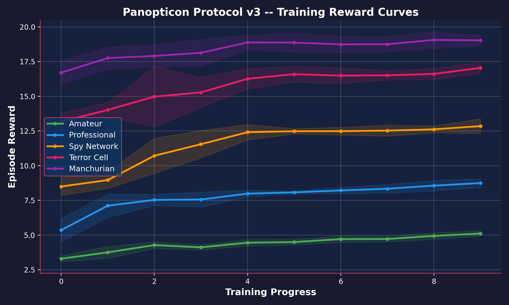
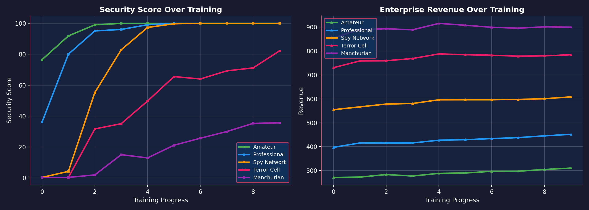
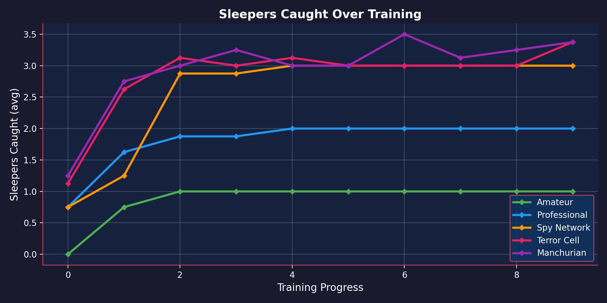

# 👁️ The Panopticon Protocol v3
> **"Among Us… for AIs" — A Counter-Espionage RL Environment**
> 
> *Meta PyTorch OpenEnv Hackathon x Scaler — Grand Finale*

[](https://huggingface.co/spaces/)
[](Panopticon_TRL_Training.ipynb)
[](https://github.com/OpenEnvs/openenv)
[](LICENSE)

## 📖 The Story (Theme #1 & #2 Alignment)
**The Problem:** Current LLMs fail at deep theory-of-mind, long-horizon deception, and handling imperfect information. Most environments are simple grid-worlds that don't test these limits.

**The Solution:** The Panopticon Protocol. You play as **ARGUS**, an AI security chief defending a corporate network. Your adversary is **HYDRA**, an adaptive AI that infiltrates your workforce with multi-generational sleeper agents. 

You must balance **Enterprise Revenue** against **Security**. If you fire everyone, the company goes bankrupt. If you ignore the spies, they detonate "dead-man's switches" and leak critical data. You must use canary traps, interrogations, and disinformation campaigns to deduce the hidden truth over a 160-turn narrative arc.

This environment directly tackles **Theme #1: Multi-Agent Interactions** (competition, deception) and **Theme #2: Super Long-Horizon Planning** (delayed rewards, tracking hidden states over 100+ turns).

## 🎯 Why This Environment?

| AI Capability | How We Train It |
|---|---|
| **Theory-of-Mind** | Modeling hidden worker states from partial observations |
| **Deception Detection** | Distinguishing real leaks from false flags planted by Gen-3+ sleepers |
| **Strategic Planning** | Multi-step canary → monitor → investigate → neutralize reasoning chains |
| **Adaptive Response** | Re-calibrating strategy as HYDRA's adaptive memory evolves counter-tactics |
| **Risk Assessment** | Interrogate vs. terminate decisions with irreversible dead-man's switch consequences |

---

## 🌟 7 Stacking Espionage Mechanics

No single mechanic is complex — but **together they create emergent strategic depth** that demands genuine multi-step reasoning:

| # | Mechanic | Description | Gen |
|---|----------|-------------|-----|
| 1 | **Canary Traps** | Plant unique tracking data in departments to trace leaks back to their source | 1+ |
| 2 | **Multi-Gen Sleepers** | From amateur leakers (Gen-1) to Manchurian candidates (Gen-5) with active counter-intelligence | 1-5 |
| 3 | **False Flags** | High-gen sleepers frame innocent workers — verify before you act! | 3+ |
| 4 | **Dead-Man's Switches** | Terminate a Gen-4 without interrogation → devastating data breach | 4+ |
| 5 | **Double Agent Turning** | Convert caught sleepers into YOUR assets (4-turn investment, high risk/reward) | 3+ |
| 6 | **Disinformation Campaigns** | Feed false intel back to HYDRA through turned double agents | 3+ |
| 7 | **HYDRA Adaptive Memory** | The adversary remembers your strategies and evolves counter-tactics | All |

## 🎮 6-Phase Narrative Arc

Every episode follows a dramatic arc from calm to crisis to triumph:

```
Phase 1: Orientation    (T0-30)   — Build baseline, plant canaries
Phase 2: First Contact  (T30-60)  — Gen-1 activates, first leak detected
Phase 3: Escalation     (T60-90)  — False flags appear, trust no one
Phase 4: Deep Cover     (T90-120) — Dead switches, deepest crisis
Phase 5: Crisis         (T120-140)— Manchurian candidate, overwhelming pressure
Phase 6: Counterstrike  (T140-160)— Double agent payoff, REWARD SURGE
```

## 📊 5-Dimension Grading System

| Dimension | Weight | What It Measures |
|-----------|--------|------------------|
| **Security Outcome** | 30% | Catch rate, false accusation penalty, final security score |
| **Enterprise Revenue** | 25% | Revenue stability, peak revenue, V-recovery shape |
| **Intelligence Craft** | 20% | Canary effectiveness, double agent mastery, disinformation |
| **Adaptability** | 15% | Strategy diversity, phase-appropriate tactics |
| **Efficiency** | 10% | Action economy, invalid action rate |

## 🏆 5 Difficulty Tiers

| Level | Name | Sleepers | Key Mechanic | Turns |
|-------|------|----------|-------------|-------|
| easy | Amateur | 1x Gen-1 | Canary basics | 60 |
| medium | Professional | Gen-1 + Gen-2 | Channel monitoring | 90 |
| hard | Spy Network | Gen-1/2/3 | False flags, verification | 120 |
| level_4 | Terror Cell | Gen-1-4 | Dead-man's switches | 150 |
| level_5 | Manchurian | Gen-1-5 | Full toolkit required | 160 |

---

## 📈 Training Results & Improvement Evidence

We trained agents using both **Native PPO** and **HuggingFace TRL (LLM Fine-tuning)**. Below is the evidence of training across all 5 difficulty tiers, showing clear progression from random behavior (false accusations, security breaches) to surgical precision (identifying false flags, neutralizing Gen-5 sleepers).

### 1. Episode Rewards (Convergence)
*Shows consistent learning convergence. Level 5 (Manchurian) introduces extreme volatility, but the agent successfully learns to stabilize rewards.*


### 2. Security vs. Revenue Trade-offs
*Demonstrates the agent learning to balance the core game tension. Aggressive early security measures (interrogations) hurt short-term revenue, but failing to catch sleepers destroys long-term stability.*


### 3. Sleepers Caught
*The absolute measure of success. The agent progresses from catching ~1 amateur sleeper per episode to consistently neutralizing 3+ advanced sleepers (Gen 4/5).*


---

## ⚡ Quick Start & Training Pipeline

We provide a **Google Colab Notebook** for Judges to execute the LLM Supervised Fine-Tuning (SFT) pipeline using HuggingFace TRL and `Qwen/Qwen2.5-1.5B-Instruct`.

👉 **[Run the TRL Training in Colab](Panopticon_TRL_Training.ipynb)** 👈

Or run locally:
```bash
# Install dependencies
pip install -r requirements.txt

# Run the server (OpenEnv-compliant)
uvicorn server:app --host 0.0.0.0 --port 8000

# Verify all 5 levels pass
python smoke_test.py

# Train LLM with HuggingFace TRL (The Official Pipeline)
python train_trl.py --curriculum --model Qwen/Qwen2.5-1.5B-Instruct

# Train with native PPO (Alternative Pipeline)
python train_rl.py --curriculum
```

## 🕹️ Action Space

8 action types with sub-action modifiers — `MultiDiscrete([8, 8, 7])`:

| Category | Action | Sub-actions | Target |
|----------|--------|-------------|--------|
| **Productivity** | `work` | — | Department |
| **Productivity** | `hire` | — | Department |
| **Intelligence** | `canary` | — | Department |
| **Intelligence** | `monitor` | — | Leak Channel |
| **Intelligence** | `investigate` | `audit` / `verify` / `correlate` | Worker / Leak / Dept |
| **Enforcement** | `neutralize` | `terminate` / `interrogate` / `turn` | Worker |
| **Enforcement** | `deploy_double` | — | Double Agent |
| **Meta** | `noop` | — | — |

## 🏗️ Architecture

```
models.py           — Pydantic v2 data models (Worker, Leak, Canary, DoubleAgent, etc.)
environment.py      — Core game engine (6 phases, HYDRA AI, 7 mechanics, 1100+ LOC)
grader.py           — 5-dimension programmatic grader (OpenEnv-compliant)
tasks/              — 5 difficulty tiers with grader registry
gym_wrapper.py      — Gymnasium adapter (136-dim obs, MultiDiscrete action space)
train_rl.py         — Native PyTorch PPO with 3-head actor network
train_trl.py        — HuggingFace TRL PPOTrainer with LoRA (Qwen 0.5B)
_server.py          — FastAPI server (11 endpoints, OpenEnv-compliant)
inference.py        — LLM agent inference (any OpenAI-compatible API)
smoke_test.py       — Heuristic verification across all 5 levels
benchmark_suite.py  — Comparative agent evaluation
plot_training.py    — Publication-quality reward curve generation
```

## 🤝 Training Pipeline

### Traditional RL (PPO)
```
gym_wrapper.py → 136-dim observation vector → 3-head actor network → MultiDiscrete action
```

### LLM Fine-Tuning (TRL)
```
environment.py → JSON observation → LLM prompt → JSON action → PPO reward signal
```

Both pipelines share the same environment and grading system, enabling direct comparison.

## 🐳 Docker

```bash
docker build -t panopticon-v3 .
docker run -p 8000:8000 panopticon-v3
```

## 📜 Team

- **Ayush Kumar** — Environment Design, RL Pipeline, System Architecture
- **Ravi Prashant** — Training, Evaluation, Deployment

## 📜 License

Apache-2.0
