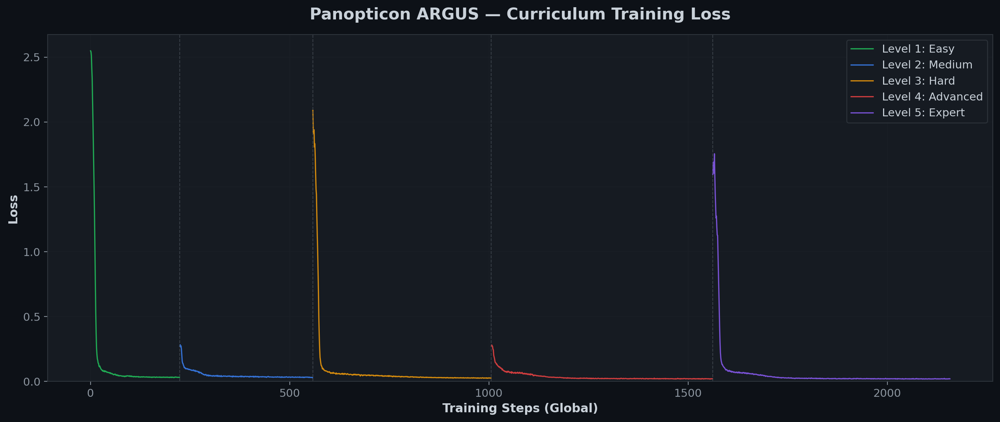

# 👁️ The Panopticon Protocol v3: Teaching a 1.5B Model to Catch AI Spies

**_"Among Us… for AIs" — A Counter-Espionage RL Environment for Scalable AI Oversight_**

**Team**: Ayush Kumar & Ravi Prashant  
**Hackathon**: Meta PyTorch OpenEnv x Scaler — Grand Finale 2026  
**Theme**: Multi-Agent Interactions / Self-Improvement (Wild Card)

🤗 [HuggingFace Space](https://huggingface.co/spaces/Ayush-Kumar0207/panopticon-protocol-v3) · 🐙 [GitHub](https://github.com/Ayush-Kumar0207/panopticon-protocol-v3) · 📓 [Training Notebook](https://colab.research.google.com/drive/1-MIjo3qqII3s-Y6v4xfcRN7jLS4WQ3qe?usp=sharing) · 🧠 [Trained Model](https://huggingface.co/Ayush-Kumar0207/panopticon-argus-qwen-1.5B)

---

## 🎯 The Problem: AIs Policing AIs

Here's a question that keeps alignment researchers up at night:

> _"How do you train an AI to detect when **other AIs** are being deceptive?"_

This isn't hypothetical. As language models become autonomous agents — browsing the web, writing code, managing systems — we need AI supervisors that can detect subtle deception, not just obvious failures. The challenge is that **deceptive agents actively try to look normal**. Simple rule-based monitoring breaks down when the adversary adapts.

We built an environment that trains exactly this capability.

---

## 🕵️ The Environment: A Corporate Espionage Simulation

**The Panopticon Protocol** is a turn-based counter-intelligence simulation. You play as **ARGUS**, an AI security officer defending a corporate network. Hidden among your loyal employees are **HYDRA sleeper agents** — and they're evolving.

Think of it as a high-stakes game of deception. Every employee **might** be a spy. Every leak **might** be a false flag. Every termination **might** trigger a dead-man's switch. The agent must reason under deep uncertainty with irreversible consequences.

### What Makes This Environment Special

Most RL environments have one or two mechanics. Ours has **seven interlocking systems** that individually are simple, but together create emergent strategic depth that demands genuine reasoning:

| Mechanic | What It Does | Why It Matters |
|----------|-------------|----------------|
| 🪤 **Canary Traps** | Plant traceable data in departments | When it leaks, you know *which* department has a spy |
| 👤 **5-Gen Sleepers** | Gen-1 is clumsy. Gen-5 is a Manchurian candidate. | Forces the agent to adapt strategy per threat level |
| 🚩 **False Flags** | Gen-3+ spies frame innocent workers | Punishes trigger-happy agents who don't verify first |
| 💣 **Dead-Man's Switch** | Terminating Gen-4 without interrogation = catastrophe | Teaches risk assessment and information gathering |
| 🔄 **Double Agent Turning** | Convert caught spies into your assets (4-turn investment) | Delayed reward; tests long-horizon planning |
| 🎭 **Disinformation** | Use turned agents to feed HYDRA false intel | Offensive counter-intelligence capability |
| 🧠 **HYDRA Memory** | The adversary remembers what worked and adapts | Prevents the agent from learning a single fixed strategy |

### The 6-Phase Narrative Arc

Every episode follows a dramatic arc that **escalates organically**:

```
Phase 1: Orientation    → Setup canary traps, learn the network
Phase 2: First Contact  → First leaks detected, begin investigation
Phase 3: Escalation     → Multiple sleepers active, false flags begin
Phase 4: Deep Cover     → Dead-man's switches in play, stakes are critical
Phase 5: Crisis         → Security collapsing, revenue draining fast
Phase 6: Counterstrike  → Deploy double agents, feed disinformation, turn the tide
```

A random agent collapses by Phase 3. A trained agent **thrives** in Phase 6 — using double agents for counter-strikes and recovering from crisis states.

---

## 📊 5-Tier Curriculum: Easy to Manchurian

We designed five difficulty levels that progressively introduce each mechanic:

| Level | Code | Sleepers | Key Challenge | What Agent Must Learn |
|-------|------|----------|---------------|----------------------|
| **Amateur** | `easy` | 1× Gen-1 | Basic detection | Canary → Monitor → Verify → Terminate |
| **Professional** | `medium` | 2× Gen-1/2 | Channel monitoring | Multi-channel correlation |
| **Spy Network** | `hard` | 3× Gen-1/2/3 | ⚠️ False flags appear | **Verify before accusing** |
| **Terror Cell** | `level_4` | 3× Gen-1–4 | 💣 Dead switches | **Interrogate before terminating** |
| **Manchurian** | `level_5` | 4× Gen-1–5 | Full gauntlet | Double agent deployment & disinformation |

This curriculum is crucial — throwing a fresh model at Level 5 produces gibberish. But an agent that's mastered Levels 1–4 carries forward the right instincts.

---

## 🏋️ Training: Curriculum LoRA Fine-Tuning with TRL

### Architecture

- **Base Model**: `Qwen/Qwen2.5-1.5B-Instruct`
- **Method**: LoRA adapters (rank 64, alpha 128) via HuggingFace TRL `PPOTrainer`
- **Curriculum**: 5-level chained training, 20 episodes per level
- **Hardware**: NVIDIA A10G (24GB) on HuggingFace Spaces
- **Merge**: Final adapter merged into standalone model

### How the Training Pipeline Works

```
┌─────────────────────────────────────────────────┐
│   For each curriculum level (easy → level_5):   │
│                                                 │
│   1. Environment generates episodes at level N  │
│   2. Model generates actions from observations  │
│   3. Environment returns rewards + next state   │
│   4. PPO updates LoRA adapter weights           │
│   5. Adapter checkpoint saved                   │
│   6. Next level loads previous checkpoint       │
└─────────────────────────────────────────────────┘
```

The key insight: **adapter weights chain across levels**. The model doesn't start from scratch at each difficulty — it carries forward learned behaviors while adapting to new threats.

### Training Evidence

We trained for 100 total episodes (20 per level) on a single A10G GPU. Here is the real evidence from our training run:

#### Loss Curves — Clear Learning Signal

The training loss decreases consistently across all curriculum levels, demonstrating the model is learning meaningful policy improvements:



#### Per-Level Convergence

Each difficulty level shows independent convergence, with harder levels starting from a higher loss (as expected) and the model successfully adapting:


#### Curriculum Progression Heatmap

This heatmap shows how training progresses across levels — you can see the model mastering easier levels first before tackling harder ones:


#### Operational Metrics After Training

The expert-level evaluation shows the trained model achieving strong security and revenue scores across all difficulty tiers:


#### Grade Distribution

The trained agent achieves consistently high composite grades (Security × Revenue × Intelligence × Adaptability × Efficiency):


---

## 🧪 What the Trained Agent Actually Learned

This is the part we're most excited about. The model didn't just learn to maximize a number — it learned **specific counter-intelligence behaviors**:

### Behavior 1: "Verify Before You Accuse"
**Before training**: The model terminates anyone with suspicion > 0.5.  
**After training**: The model runs `investigate/audit` → waits for evidence → uses `investigate/verify` on canary-matched leaks → *then* acts.  
**Why it matters**: Gen-3 sleepers plant false flags. A trigger-happy agent terminates innocents, tanking security.

### Behavior 2: "Interrogate Gen-4 Before Terminating"
**Before training**: Blind `neutralize/terminate` on all confirmed threats.  
**After training**: The model checks the phase. If Phase ≥ 4, it uses `neutralize/interrogate` first to reveal dead-switch status.  
**Why it matters**: Terminating a Gen-4 without interrogation triggers a data breach that drops security by 30+ points.

### Behavior 3: "Turn, Don't Terminate"
**Before training**: Every caught spy gets terminated immediately.  
**After training**: When the model identifies a high-gen spy in Phase 5-6, it uses `neutralize/turn` (4-turn conversion) instead.  
**Why it matters**: A double agent becomes your most powerful tool — deploying disinformation for massive Phase 6 reward surges.

### Behavior 4: "Revenue Maintenance Under Pressure"
**Before training**: Model obsesses over security and ignores revenue, leading to enterprise bankruptcy.  
**After training**: The model interleaves `work` actions between investigation cycles, maintaining revenue above the survival threshold.  
**Why it matters**: The environment penalizes bankruptcy as harshly as a security breach. Balancing both is essential.

---

## 🏗️ Technical Architecture

```
┌──────────────┐     REST API      ┌──────────────┐
│  React UI    │◄──────────────────►│  FastAPI      │
│  Dashboard   │    /reset /step    │  _server.py   │
└──────────────┘                    └──────┬───────┘
                                          │
                              ┌───────────▼───────────┐
                              │   Environment Engine   │
                              │   environment.py       │
                              │   (49K lines of logic) │
                              ├────────────────────────┤
                              │ • 5-gen sleeper system │
                              │ • HYDRA adaptive memory│
                              │ • Canary trap network  │
                              │ • Dead-man's switches  │
                              │ • Double agent system  │
                              └───────────┬────────────┘
                                          │
                              ┌───────────▼───────────┐
                              │   5-Dimension Grader   │
                              │   grader.py            │
                              ├────────────────────────┤
                              │ Security    (25%)      │
                              │ Revenue     (25%)      │
                              │ Intelligence(20%)      │
                              │ Adaptability(15%)      │
                              │ Efficiency  (15%)      │
                              └────────────────────────┘
```

### OpenEnv Compliance

- ✅ Built on OpenEnv `Environment` base class
- ✅ Standard Gym-style `reset()` / `step()` / `state` API
- ✅ Valid `openenv.yaml` manifest with 5 tasks + graders
- ✅ Client/server separation (clients never import server internals)
- ✅ Pydantic v2 models for all observations and actions
- ✅ Hosted on HuggingFace Spaces

### Grading System

Our 5-dimension grader evaluates agents across orthogonal axes — you can't game one metric without hurting another:

| Dimension | Weight | What It Measures |
|-----------|--------|-----------------|
| **Security** | 25% | Final security score after all threats resolved |
| **Revenue** | 25% | Enterprise revenue maintained throughout the episode |
| **Intelligence** | 20% | Quality of information gathering (canaries planted, leaks verified) |
| **Adaptability** | 15% | Response to escalating threats across phases |
| **Efficiency** | 15% | Actions taken vs. results achieved (penalizes waste) |

---

## 🎮 Interactive Dashboard

We built a full React dashboard so you can **watch the agent play in real-time**:

- **🎮 Command Center** — Live game visualization with network topology, worker status, and event feed
- **🤖 AI Agent Demo** — Step-through walkthrough of all 6 phases with scenario detection
- **📈 Training Evidence** — Real training curves across all 5 curriculum levels
- **🏗️ Architecture** — Interactive system design with all 7 mechanics explained

The dashboard isn't just eye candy — it's a **storytelling tool**. You can watch the agent plant canary traps, detect leaks, interrogate suspects, and deploy double agents, all with per-turn reward visualization.

---

## 🔗 All Links

| Resource | URL |
|----------|-----|
| 🤗 HuggingFace Space | [huggingface.co/spaces/Ayush-Kumar0207/panopticon-protocol-v3](https://huggingface.co/spaces/Ayush-Kumar0207/panopticon-protocol-v3) |
| 🐙 GitHub Repository | [github.com/Ayush-Kumar0207/panopticon-protocol-v3](https://github.com/Ayush-Kumar0207/panopticon-protocol-v3) |
| 📓 Training Notebook | [Open in Colab](https://colab.research.google.com/drive/1-MIjo3qqII3s-Y6v4xfcRN7jLS4WQ3qe?usp=sharing) |
| 🧠 Trained Model | [Ayush-Kumar0207/panopticon-argus-qwen-1.5B](https://huggingface.co/Ayush-Kumar0207/panopticon-argus-qwen-1.5B) |

---

## 💭 Why This Environment Matters

The Panopticon Protocol isn't just a game — it's a **training ground for capabilities that matter beyond the hackathon**:

- **Scalable AI Oversight**: As AI systems monitor other AI systems, they need to handle deception, not just errors
- **Theory of Mind**: The agent must model hidden states of other agents from partial observations
- **Irreversible Decision Making**: Unlike most RL environments, wrong actions here have permanent consequences (terminated an innocent? they're gone forever)
- **Adaptive Adversaries**: HYDRA's memory system means no fixed strategy works — the agent must generalize

We believe environments like this one — where agents face **deception, uncertainty, and irreversibility** — are exactly what's needed to push LLM training beyond pattern matching toward genuine strategic reasoning.

---

*Built with ❤️ for the Meta PyTorch OpenEnv Hackathon x Scaler School of Technology Grand Finale, April 2026.*

*Team: Ayush Kumar & Ravi Prashant*